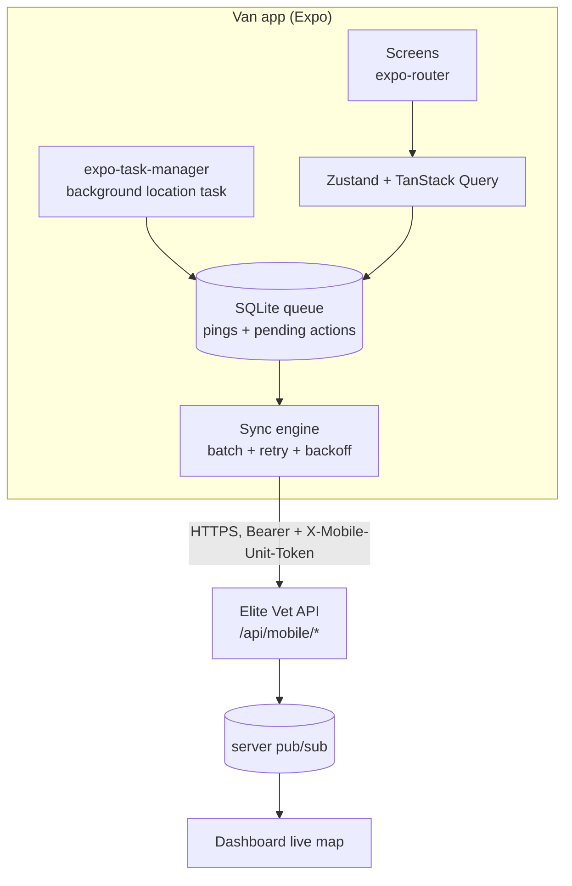

# Elite Vet — Van App (تطبيق الوحدة المتنقلة) — Build Plan

> **Audience:** the agent building the mobile app. This document is **self-contained** —
> you do not need access to the Elite Vet web repo to build against it. The server side
> is specified in `docs/mobile-clinics-module-plan.md` (same repo, §5 auth and §9 API).
> **Deliverable:** an Expo / React Native app used by van crews (driver + vet/technician)
> to open a shift, stream GPS, work today's stops, and manage on-board stock.
> **Not** a pet-owner app. Owners get a no-login web tracking link instead.

---

## 1. Decisions already made (do not relitigate)

| # | Decision | Note |
|---|---|---|
| **D3** | **Expo (managed) + React Native**, `expo-location` + `expo-task-manager` for background updates, EAS Build for distribution. | No paid geolocation SDK in v1. `react-native-background-geolocation` is the documented upgrade path if Android OEM battery killers prove fatal in the field — keep the location layer behind one module so the swap is contained. |
| **D2** | **Two credentials per request:** a staff bearer session **and** a van device token. | See §4. This is what makes "disable the van from the dashboard and the app stops" work. |
| — | **Arabic-first, RTL**, matching the web app. | `I18nManager.forceRTL(true)`. English strings exist but Arabic is the shipped default. |
| — | **Offline-tolerant, not offline-first.** | GPS pings and stage transitions queue and retry. Clinical records are **not** authored offline in v1 — the app fetches visit data and posts outcomes; a dead zone delays a post, it does not fork the record. |

---

## 2. Who uses it

| Role | Needs |
|---|---|
| **Driver** | Open/close the shift, see the route, navigate to the next stop, mark en-route/arrived |
| **Vet / technician** | The stop's pet + service details, record notes and photos, consume on-board stock, mark the visit complete or failed |

Both are `Staff` rows in the main system with normal logins. A crew member may hold both
roles. The app does not have its own user directory.

---

## 3. Architecture



**Three things run independently:**

1. **The background location task** — owned by the OS, survives app backgrounding, writes
   straight to SQLite. It never talks to the network itself.
2. **The sync engine** — a foreground/background-fetch loop that drains the SQLite queue
   in batches, with exponential backoff. Only it touches the network.
3. **The UI** — reads server state via TanStack Query, writes user actions into the same
   queue so a tunnel never loses a tap.

This separation is the single most important structural decision in the app. Do not let
a screen POST a ping directly.

---

## 4. Authentication

Every `/api/mobile/*` request carries **both** headers:

```
Authorization: Bearer <better-auth session token>
X-Mobile-Unit-Token: <raw van token>
```

### First run — pairing

1. Admin creates the van in the dashboard and pairs a device. The raw van token is shown
   **exactly once**, as text and as a QR code.
2. The app's pairing screen scans the QR (`expo-camera` + `expo-barcode-scanner`) or
   accepts manual entry. Store it in `expo-secure-store` — **never** `AsyncStorage`.
3. The staff member signs in with their normal email/password. The bearer token also goes
   to `expo-secure-store`.
4. `GET /api/mobile/bootstrap` returns the unit, crew, settings and server time. Cache it.

### Server responses the app must handle distinctly

| Status | Meaning | App behaviour |
|---|---|---|
| **401** | Session expired **or** van token revoked | Re-auth screen. If `code = "DEVICE_REVOKED"`, clear the van token too and return to pairing. |
| **403** | Staff not on this van's crew | "لست ضمن طاقم هذه الوحدة" — offer sign-out. |
| **423 Locked** | **The van was disabled from the dashboard** | **Hard lock screen** (§7). This is requirement 4 and is the one non-negotiable behaviour in the app. |
| **409** | Shift already open / stale stage transition | Refetch and reconcile; never retry blindly. |
| **422** | Validation | Show the server's Arabic message verbatim. |

All server error messages are Arabic and safe to display as-is. Do not write your own
copy for server-originated errors.

---

## 5. Location tracking — the crux

### Permissions flow

Request **foreground first**, explain, then request **background** (`Always` on iOS,
`ACCESS_BACKGROUND_LOCATION` on Android) with a plain-language screen. Both stores reject
apps that ask for background location without an in-context explanation.

`app.json` essentials:

```jsonc
{
  "expo": {
    "plugins": [["expo-location", {
      "locationAlwaysAndWhenInUsePermission":
        "يستخدم التطبيق موقع المركبة أثناء الوردية لتتبع الوحدة المتنقلة وتحديث وقت الوصول للعملاء.",
      "isAndroidBackgroundLocationEnabled": true,
      "isAndroidForegroundServiceEnabled": true
    }]],
    "ios": { "infoPlist": { "UIBackgroundModes": ["location", "fetch"] } },
    "android": { "permissions": [
      "ACCESS_FINE_LOCATION", "ACCESS_COARSE_LOCATION",
      "ACCESS_BACKGROUND_LOCATION", "FOREGROUND_SERVICE", "FOREGROUND_SERVICE_LOCATION"
    ]}
  }
}
```

### The background task

```ts
// location-task.ts — registered once, at module scope, NOT inside a component
TaskManager.defineTask(LOCATION_TASK, async ({ data, error }) => {
  if (error || !data) return;
  const { locations } = data as { locations: Location.LocationObject[] };
  await queue.enqueuePings(locations.map(toPing));   // SQLite only. No fetch here.
});

await Location.startLocationUpdatesAsync(LOCATION_TASK, {
  accuracy: Location.Accuracy.High,
  timeInterval: cadenceMs,           // from bootstrap settings
  distanceInterval: 25,              // metres — suppresses parked jitter
  deferredUpdatesInterval: 30_000,   // iOS batching
  pausesUpdatesAutomatically: false,
  showsBackgroundLocationIndicator: true,
  foregroundService: {
    notificationTitle: "الوردية جارية",
    notificationBody: "يتم تتبع موقع الوحدة أثناء الوردية",
    notificationColor: "#0f766e",
  },
});
```

**The Android foreground service is mandatory, not cosmetic.** Without a visible
persistent notification, Android will kill background location within minutes on most
OEM builds (Xiaomi, Oppo, Huawei, Samsung's aggressive modes). This is the known weak
point of D3 and the notification is the mitigation.

### Cadence (server-driven, from `/bootstrap`)

| Van state | Interval | Rationale |
|---|---|---|
| `EN_ROUTE` | **15 s** | The owner is watching a tracking link |
| `ON_SITE`, `AVAILABLE`, `ON_BREAK` | **60 s** | Presence, not motion |
| No open shift | **stopped** | Never track a crew member off-shift — this is a privacy line, and stores check it |

Also flush the queue immediately on any stage change.

### Ping payload

```ts
type Ping = {
  lat: number; lng: number;
  accuracyM?: number; speedKph?: number; heading?: number; altitudeM?: number;
  batteryPct?: number; isMoving: boolean; isCharging?: boolean;
  recordedAt: string;   // ISO 8601, device clock
};
```

`POST /api/mobile/pings` with `{ pings: Ping[] }`, **max 50 per request**. The server
dedupes on `(mobileUnitId, recordedAt)`, so re-sending a batch after an ambiguous
timeout is safe — **always retry rather than risk losing the queue**.

Server-side clamps you should mirror client-side to save bandwidth: drop pings with
`accuracyM > 200`, drop anything older than 24 h, never send a future timestamp.

### Battery discipline

- `distanceInterval: 25` suppresses the parked-vehicle jitter that otherwise generates
  thousands of identical rows.
- Drop to 60 s the moment the stage leaves `EN_ROUTE`.
- Stop entirely when the shift closes — no exceptions, no "just in case".
- Surface a battery reading in every ping so dispatch can see a dying device before it
  goes dark.

---

## 6. Screens

`expo-router`, file-based, RTL throughout.

| Screen | Contents |
|---|---|
| **Pair device** | QR scan / manual token entry → validate via `/bootstrap` |
| **Sign in** | Email + password → bearer token |
| **Home / shift** | Big **بدء الوردية / إنهاء الوردية** button, odometer prompt, current status chip with a manual override (`AVAILABLE / ON_BREAK / RETURNING / OUT_OF_SERVICE`), today's stop count, sync indicator (queued item count), GPS-health indicator |
| **Today's route** | Ordered stop list from `GET /api/mobile/visits/today` — owner name, pet, services, address, arrival window, stage chip. Pull to refresh. |
| **Stop detail** | Address + landmark + access notes, **"افتح في الخرائط"** deep link, owner phone (tap to call/WhatsApp), pet summary and relevant history, service list, action bar: `في الطريق → وصلت → بدء الخدمة → إنهاء` plus **تعذّر التنفيذ** with a reason picker |
| **Visit outcome** | Notes, photos (`expo-image-picker`, compressed before queueing), consumed items, optional owner signature |
| **Van stock** | On-board levels from `GET /api/mobile/stock`, search, low-stock highlight, per-visit consume flow. Read-mostly — restocking happens in the dashboard as a warehouse transfer. |
| **Locked** | See §7 |
| **Settings** | Language, unit info, app version, device id, sign out, unpair |

**Navigation deep link:** open the platform map app rather than embedding navigation —
`geo:` on Android, `maps://` on iOS, with a `https://www.google.com/maps/dir/?api=1&destination=lat,lng`
fallback. Do not build turn-by-turn.

---

## 7. The lock screen (requirement 4)

When any request returns **423**:

1. Immediately stop location updates and unregister the background task.
2. Auto-close the local shift state.
3. Show a full-screen, non-dismissible: **«تم إيقاف هذه الوحدة. تواصل مع الإدارة.»**
   with the clinic phone number and a **إعادة المحاولة** button.
4. Poll `/api/mobile/bootstrap` every 60 s. When it returns 200, unlock and resume.
5. Do **not** clear the stored tokens — a disable is usually temporary. Only
   `DEVICE_REVOKED` (401) clears the van token.

The queued pings stay in SQLite through a lock; they flush on unlock. Nothing is lost.

---

## 8. Offline queue

One SQLite table (`expo-sqlite`), two kinds of rows:

```sql
CREATE TABLE outbox (
  id INTEGER PRIMARY KEY AUTOINCREMENT,
  kind TEXT NOT NULL,          -- 'ping' | 'action'
  endpoint TEXT NOT NULL,
  payload TEXT NOT NULL,       -- JSON
  createdAt TEXT NOT NULL,
  attempts INTEGER DEFAULT 0,
  lastError TEXT
);
```

- **Pings** batch up to 50 and are safe to replay (server dedupes).
- **Actions** (stage transitions, notes, consumption) drain **strictly in order** and
  **stop on first failure** — a stage machine replayed out of order produces nonsense.
- Backoff: 2 s → 4 s → 8 s → … capped at 5 min. Retry immediately on a connectivity
  regain event (`expo-network`).
- `expo-background-fetch` drains the queue when the app is not foregrounded.
- The queue depth is always visible in the header. A crew member must be able to tell
  "the server has this" from "my phone still has this" without asking anyone.
- Cap the queue at ~10,000 rows; drop oldest **pings** first, never drop actions.

---

## 9. API contract

Base: `https://<host>/api`. All responses JSON. All error messages Arabic.
Send `Content-Type: application/json` except photo upload (multipart).

```
GET   /mobile/bootstrap
      → { unit: { id, code, name, plateNumber, status, active },
          crew: [{ staffId, name, role }],
          shift: { id, startedAt } | null,
          settings: { pingIntervalMs: { enRoute, idle }, distanceIntervalM,
                      arrivalWindowMinutes, staleThresholdMs },
          serverTime: ISO }

POST  /mobile/shifts/start          { odometerStart?, lat, lng } → { shiftId, startedAt }
POST  /mobile/shifts/:id/end        { odometerEnd? }             → { distanceKm, visitsCompleted }
POST  /mobile/pings                 { pings: Ping[] }            → { accepted, duplicates }
PATCH /mobile/status                { status }                   → { status }

GET   /mobile/visits/today          → Visit[]  (ordered by sequence)
GET   /mobile/visits/:id            → VisitDetail
PATCH /mobile/visits/:id/stage      { stage, reason?, lat?, lng?, at }  → VisitDetail
POST  /mobile/visits/:id/notes      { note }
POST  /mobile/visits/:id/photos     multipart

GET   /mobile/stock                 → { items: [{ itemId, name, qty, unit, batches[] }] }
POST  /mobile/stock/consume         { visitId, items: [{ itemId, qty, batchId? }] }
```

`stage` ∈ `EN_ROUTE | ARRIVED | IN_SERVICE | COMPLETED | FAILED`.
Send `lat`/`lng` with `ARRIVED` — the server stores it as arrival proof and computes
drift from the service address.

`reason` is required when `stage = FAILED`, one of `NO_ANSWER | ADDRESS_NOT_FOUND |
ACCESS_DENIED | PET_UNAVAILABLE | OWNER_CANCELLED | VEHICLE_ISSUE | WEATHER | OTHER`.

**Always send `at` (device ISO timestamp) on stage transitions.** A queued transition
that lands ten minutes late must record when it actually happened, not when it synced.

---

## 10. Tech choices

| Concern | Choice |
|---|---|
| Framework | Expo SDK (latest stable) + React Native, TypeScript strict |
| Routing | `expo-router` |
| Server state | TanStack Query (same mental model as the web app) |
| Local state | Zustand |
| Storage | `expo-secure-store` (tokens), `expo-sqlite` (outbox + cache) |
| Location | `expo-location` + `expo-task-manager` |
| Background sync | `expo-background-fetch` |
| Camera/QR | `expo-camera`, `expo-image-picker` |
| Connectivity | `expo-network` |
| Notifications | `expo-notifications` (new-stop assigned, shift reminder) |
| Forms | `react-hook-form` + `zod` (mirrors the web repo) |
| i18n | `i18next` + `react-i18next`, `I18nManager.forceRTL(true)` |
| Errors | Sentry (`sentry-expo`) — same org as the web app |
| Build | EAS Build; internal distribution first, stores later |
| Updates | EAS Update for JS-only fixes |

**Type sharing:** the web repo derives all types from Prisma and Zod, and hand-written
duplicates drift silently. There is, however, **no machine-readable contract to generate
from today** — this was checked, not assumed:

- better-auth's `openAPI()` plugin is enabled, but it documents only the `/api/auth/*`
  endpoints. It says nothing about `/api/mobile/*`.
- `@elysiajs/openapi` is in `package.json` but is **not mounted** in `src/server/app.ts`,
  so the Elysia app publishes no schema.
- Eden Treaty (`src/lib/api.ts`) gives the web client end-to-end types, but it works by
  importing the server's TypeScript types directly — which a separate repo cannot do.

So for now: **hand-write a single `src/api/contract.ts` in the app** transcribing §9, and
treat it as provisional. It is the one place duplication is allowed, so keep it to one
file and never spread those shapes through components. The permanent fix is a web-repo
task — mount `@elysiajs/openapi` (already a dependency) and generate the app's types from
its schema. Raise it once A1 is working rather than blocking on it; the contract in §9 is
stable enough to build against.

---

## 11. Phases

| Phase | Deliverable | Exit |
|---|---|---|
| **A0 — Skeleton** | Expo app, RTL, i18n, navigation shell, Sentry, EAS internal build installs on a real device | An Arabic screen renders RTL on a physical phone |
| **A1 — Auth & pairing** | QR pairing, sign-in, secure storage, `/bootstrap`, and **all five** status behaviours from §4 including the 423 lock screen | Disabling the van in the dashboard locks the app within one request cycle |
| **A2 — Shift & location** | Permission flow, background task, foreground service, SQLite ping queue, batch sync, cadence switching | Van moves → the dashboard marker moves within ~3 s; airplane mode for 10 min then reconnect → no gap in the trail |
| **A3 — Route & stops** | Today's list, stop detail, map deep link, stage transitions through the queue, call/WhatsApp the owner | A full stop runs end to end on a real device, including one transition made while offline |
| **A4 — Outcomes** | Notes, photos, failure reasons, signature | A failed visit with a reason appears correctly on the dashboard |
| **A5 — Stock** | On-board levels, consume-per-visit | Consumption decrements the van's warehouse bin and nothing else |
| **A6 — Hardening** | Battery profiling over a real 8-hour shift, OEM battery-killer testing (Xiaomi/Samsung/Oppo), queue-cap behaviour, low-connectivity soak | Battery drain and ping-loss numbers measured and written into the PR body, not estimated |

---

## 12. Testing that actually matters

Unit tests are cheap here; the failures that will hurt are environmental. Budget for:

- **A real 8-hour shift** on each of iOS and Android, measuring battery drain and
  counting missing pings against expected.
- **OEM battery killers.** Xiaomi/MIUI, Samsung, Oppo/ColorOS each need the app
  allow-listed; test what happens when it is *not*, and make sure dispatch sees a stale
  badge rather than a frozen-but-plausible marker.
- **Tunnel/dead-zone replay** — 10 minutes offline mid-route, then reconnect. Verify
  ordering of queued actions and the absence of duplicate pings.
- **Clock skew** — set the device clock 5 minutes off and confirm the server clamps
  rather than accepting nonsense.
- **Kill and relaunch** mid-shift; the background task must resume without re-pairing.
- **Disable the van** while the app is mid-visit (§7).
- **Airplane mode during a stage transition** — the tap must not be lost.

---

## 13. Privacy & store review

- Track **only** while a shift is open. Never off-shift. This is both an ethical line and
  what makes the background-location justification defensible to reviewers.
- Both stores require an in-context explanation screen *before* the background-location
  prompt, and a privacy-policy URL covering location collection, retention and purpose.
- The app is for clinic staff, so use **internal/enterprise distribution** where possible;
  a public store listing invites reviewer questions about background location that
  internal distribution avoids entirely.
- Retention on the server is 30 days raw, downsampled to one point per minute, dropped
  after 12 months. State this in the policy and keep the two in sync.

---

## 14. What this app deliberately does not do

Turn-by-turn navigation · route optimisation · offline authoring of clinical exams ·
payments and invoicing (the dashboard bills; the van records what was done) · pet-owner
features (owners get the no-login web tracking link) · warehouse-to-van restocking (a
dashboard transfer, so the stock ledger stays the single authority).
