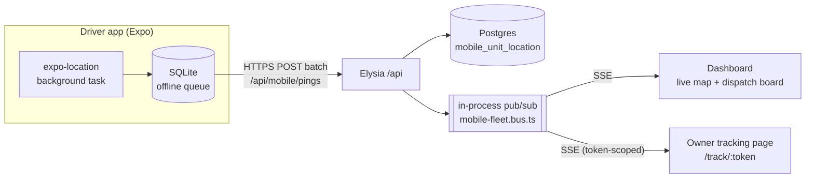

# Mobile Clinics (العيادات المتنقلة) — Master Plan

> **Scope:** `/care/mobile-clinic` — managing a fleet of veterinary vans that deliver
> basic services (grooming, vaccination, medication, wellness exams) at the owner's
> location, plus the live map, dispatch, van stock, and the public request form.
> **Design goal:** the van is a **moving branch**. Every clinical structure reuses the
> existing visit stack; the module adds only what is genuinely new — *where the van is,
> who is on it, what is on board, and which stop it is doing next*.
> **Companion doc:** `docs/mobile-clinics-driver-app-plan.md` (the React Native app —
> built by a separate agent against the API contract in §9 of this file).

---

## 0. Where we are today

> **This section describes the state BEFORE the build (2026-08-17) and is kept as the
> record of what was inherited.** For current status see §11.

The module was a stub with real groundwork already committed:

| Already exists | Location |
|---|---|
| Sidebar nav item `sidebar.items.mobileClinic` → `/care/mobile-clinic`, `LuTruck` icon | `src/components/sidebar/app-sidebar.tsx:207-212` |
| Placeholder page, `careTitles["mobile-clinic"] = "العيادة المتنقلة"` *(مفرد — وُحّد لاحقًا إلى «العيادات المتنقلة» وأُزيل المدخل، إذ صار للوحدة مسار ثابت)* | `src/routes/_pathless-layout/care.$slug.tsx` |
| AR/EN i18n keys | `src/locales/{ar,en}/translation.json:623` |
| `StaffSchedulingSettings.mobileClinicAppointmentsEnabled` — **in the DB, unused** | `prisma/schema.prisma:2742`, UI at `src/features/services/staff/components/tabs/scheduling-tab.tsx:198-205` |
| `ServiceDeliveryType.MOBILE_CLINIC`, `ClinicSpecialtyType.MOBILE_SERVICES` asked at onboarding | `prisma/schema.prisma:3626-3660`, `src/routes/_onboarding-layout/onboarding.tsx:106,155` |

Nothing consumes any of it. There is **no** mobile-clinic Prisma model, server module,
or feature folder.

### What we reuse rather than rebuild

| Need | Reused asset |
|---|---|
| The visit itself | `Appointment` **is** the visit — no `Visit` model exists. `AppointmentLocation` already has `IN_CLINIC \| REMOTE \| HOME_VISIT`. |
| Visit state machine | `src/server/appointments/appointments.workflow.ts` (pure, tested, shared client+server) + `docs/appointments-workflow.md` |
| Two-level status × stage pattern | `src/server/radiology/radiology.workflow.ts` — the precedent for adding a dispatch stage on top of `AppointmentStatus` |
| Van stock | `Warehouse` (`branchId` already nullable) + `postStockMovement` / `postStockTransfer` / FEFO batches / moving-average valuation in `src/server/stock/stock-ledger.service.ts` |
| Warehouse-to-warehouse restock | `POST /api/stock/transfer` → `stockDao.createTransfer` (`src/server/stock/stock.dao.ts:450-498`) |
| Slot engine | `src/server/scheduling/slot-computation.ts` |
| Public form + rate limiting | `src/server/public/`, `src/server/public-bookings/`, `src/features/booking/`, `src/routes/book.$slug.tsx` |
| Live push to the dashboard | SSE pattern in `src/server/inbox/inbox.controller.ts` + `src/features/inbox/hooks/use-inbox-stream.ts` |
| Possession-of-link authorization | `src/server/video-calls/video-calls.controller.ts:67-96` (guest token, `pay.$room.tsx`) |
| Per-entity JSON config | `Branch.settings` + `branchSettingsSchema` / `parseBranchSettings` (`src/server/branches/branches.type.ts:158-286`) |
| Audit trail shape | `AppointmentActivity` + `AppointmentActivityType` |

### What is genuinely net-new

- **All geography.** There is not a single latitude/longitude column in 8,791 lines of
  `prisma/schema.prisma`. The only geo-ish field is `Supplier.mapUrl String?`.
- **All mapping.** No `leaflet` / `mapbox-gl` / `maplibre-gl` / Google Maps in
  `package.json`. Charting is Recharts only.
- **Non-cookie auth.** `src/lib/auth/index.ts` runs better-auth with plugins
  `i18n`, `emailOTP`, `openAPI` only — no `bearer`, no `apiKey`, no `jwt`. Auth is
  cookie-session exclusively. (`env.BETTER_AUTH_API_KEY` is declared in `src/env.ts:21`
  and referenced nowhere — dead config, ignore it.)

---

## 1. Owner decisions (binding for this module)

Recorded 2026-08-17. These override "ask before coding" for the areas they cover.

| # | Decision | Consequence |
|---|---|---|
| **D1** | **Map = MapLibre GL JS + OpenStreetMap raster/vector tiles.** | New dep `maplibre-gl` (+ `react-map-gl` maplibre adapter) — the one UI-library exception granted under CLAUDE.md rule #1, granted for *maps only*. Styling still comes from design tokens; the map canvas is the sole exception. No Google Maps SDK. Geocoding via Nominatim with a self-host path; routing/ETA via OSRM or straight-line fallback (§8). |
| **D2** | **Van auth = staff bearer session + van device token.** | Add the better-auth `bearer` plugin. Staff authenticate with their normal credentials; the device additionally presents a van token. Disabling a `MobileUnit` locks every paired device (requirement 4). |
| **D3** | **Driver app = Expo + React Native, `expo-location` + `expo-task-manager` background updates.** | No paid geolocation SDK in v1. Accept slightly weaker background survival on aggressive Android OEMs; mitigate with foreground service notification + offline queue (driver-app plan §5). |
| **D4** | **Public booking = request → dispatcher assigns.** | The guest form creates a `MobileBookingRequest`, **not** an `Appointment`. No travel-time-aware slot math is required to launch. Direct booking on live van slots is explicitly deferred to §11 (post-v1). |

### Open items still needing a decision before the phase that needs them

- **O1 — RESOLVED (2026-08-18).** `VITE_MAP_STYLE_URL` is set to OpenFreeMap
  (`https://tiles.openfreemap.org/styles/liberty`): OSM-derived vector tiles, **no API key**,
  no usage cap, and production use is expressly permitted — which is precisely what the
  public OSM tile servers forbid. Its labels are bilingual (`name:latin` + `name:nonlatin`),
  so Saudi place names render in Arabic alongside Latin, which suits an Arabic-first UI.
  **Caveat:** the project is donation-funded with no SLA. For critical production, swap in a
  paid provider (MapTiler / Stadia) — that is a one-line env change and touches no code,
  which is exactly why the style URL was made configurable rather than hardcoded.
- **O2 — RESOLVED as recommended.** Van stock is consumed on payment of the products
  section, exactly as clinic stock is; `resolveIssueWarehouseId` only changes *which*
  warehouse, never *when*. The van app can also consume explicitly mid-visit via
  `POST /api/mobile/stock/consume` when the crew records usage on the spot.
- **O3 — RESOLVED.** `MobileVisit.travelFee` is written at both visit-creation paths
  (conversion copies the fee of the zone matched when the request arrived — the zone the
  dispatcher actually saw; `attachToAppointment` matches the service address when it has
  coordinates), and it is **billed** as an `AppointmentService` line, so it rides the
  existing invoice and inherits the §10 accounting adapter — no second billing document.

  The node is global (`clinicId = NULL`), owner decision, seeded by migration
  `20260818180000_mobile_clinics_travel_fee_service` as a full CATEGORY «رسوم» →
  SUBCATEGORY «العيادة المتنقلة» → ITEM «رسوم التنقل» path, because `services.dao` builds
  a strict three-level tree and a parentless ITEM has no place in it. Referenced by fixed
  id (`TRAVEL_FEE_SERVICE_ID`), never by name — renaming the node from the services screen
  is legitimate and would silently stop travel billing. `isDefault = true` blocks deletion.

  Stored as a snapshot, so re-pricing a zone never moves an agreed visit's fee; `null` is
  "no matching zone or no fee", deliberately not `0`. A zero or negative fee writes no
  line — a 0 SAR row is noise on the owner's invoice.

- **O4 — RESOLVED.** Device pairing shows a QR code. `qrcode` was added and is used
  **server-side only** (`mobile-units/device-qr.ts`): the pair endpoint returns a data URI
  the dialog renders as a plain ``, so not a byte of it reaches the client bundle and
  CLAUDE.md rule 1 is untouched — the alternative (`qrcode.react` and its kin) genuinely is
  a UI component library. Exposure is unchanged, since the response already carried the raw
  token in plaintext; the image encodes a secret that was already there. Two conditions keep
  the one-time-reveal property honest: the response is `Cache-Control: no-store`, and the
  QR field is never logged. The token text stays under the code — scanning can fail.

---

## 2. Vision & scope

One fleet, one dispatch board, one visit record.

**In scope (v1):**
fleet master data · van↔warehouse binding · crew rosters · shifts · device pairing and
revocation · GPS ingest and trail · live map · dispatch board and day route · mobile
visit lifecycle (assigned → en route → arrived → in service → completed/failed) · van
stock (restock, on-board levels, consumption) · public request form and triage queue ·
owner tracking link · service zones and travel fee · fleet KPIs.

**Out of scope (v1), with a hook point each:**

| Deferred | Hook left in place |
|---|---|
| Multi-stop route *optimisation* (TSP) | `MobileVisit.sequence` is a plain integer — an optimiser just rewrites it |
| Turn-by-turn navigation in-app | App deep-links to the device's map app |
| Vehicle maintenance, fuel, odometer analytics | `MobileUnitShift.odometerStart/End` captured from day one; the module lands in P8 |
| Direct owner self-booking onto live van slots | `MobileBookingRequest.status` already has `SCHEDULED`; the direct path just skips `NEW` |
| Geofence-triggered automation | `MobileVisit.arrivalLat/Lng` + `ServiceZone` polygons make this additive |
| Ledger posting | Rides the existing `Invoice`, so it inherits the §7.1 WRAP adapter from the accounting contract for free (§10) |

---

## 3. Domain model

Naming follows repo convention: Prisma fields **camelCase**, tables **snake_case** via
`@@map`, ids `cuid()`, human codes via `generateUniqueCode` (`src/lib/generate-code.ts`),
soft delete `isDeleted`/`deletedAt`, `editsCount` on mutable masters.

### 3.1 Fleet

```prisma
model MobileUnit {                       // @@map("mobile_unit")
  id            String   @id @default(cuid())
  code          String   @unique         // MU-A3F9, generateUniqueCode
  clinicId      String                   // tenant
  branchId      String                   // home branch (C5: branch = cost center, never a company)
  warehouseId   String   @unique         // 1:1 van stock location

  name          String                   // "الوحدة المتنقلة ١"
  plateNumber   String?
  make          String?
  model         String?
  year          Int?
  color         String?
  photo         String?

  status        MobileUnitStatus @default(OFFLINE)   // operational
  active        Boolean          @default(true)      // ADMIN kill-switch → requirement 4
  isDeleted     Boolean          @default(false)
  deletedAt     DateTime?

  // denormalised last-known position (source of truth is MobileUnitLocation)
  lastLat        Decimal?  @db.Decimal(9, 6)
  lastLng        Decimal?  @db.Decimal(9, 6)
  lastLocationAt DateTime?
  lastSpeedKph   Decimal?  @db.Decimal(6, 2)
  lastHeading    Int?
  lastBatteryPct Int?

  settings      Json?                    // parsed by mobileUnitSettingsSchema, mirrors Branch.settings
  notes         String?
  editsCount    Int      @default(0)

  @@unique([clinicId, name])
  @@index([clinicId, active, status])
}
```

`MobileUnitStatus` = `OFFLINE | AVAILABLE | EN_ROUTE | ON_SITE | RETURNING | ON_BREAK | OUT_OF_SERVICE`

**`active` and `status` are deliberately separate.** `active` is the dashboard
kill-switch (requirement 4) and only an admin flips it. `status` is derived from what
the van is doing and is written by the app or the dispatcher.

```prisma
model MobileUnitCrew {                   // @@map("mobile_unit_crew")
  id           String  @id @default(cuid())
  clinicId     String
  mobileUnitId String
  staffId      String
  role         MobileUnitCrewRole        // DRIVER | VET | TECHNICIAN | GROOMER | ASSISTANT
  isPrimary    Boolean @default(false)
  active       Boolean @default(true)

  @@unique([mobileUnitId, staffId])
  @@index([clinicId, staffId])
}

model MobileUnitShift {                  // @@map("mobile_unit_shift")
  id              String    @id @default(cuid())
  clinicId        String
  mobileUnitId    String
  openedByStaffId String
  startedAt       DateTime
  endedAt         DateTime?
  odometerStart   Int?
  odometerEnd     Int?
  startLat        Decimal?  @db.Decimal(9, 6)
  startLng        Decimal?  @db.Decimal(9, 6)
  distanceKm      Decimal?  @db.Decimal(10, 2)   // computed on close from the trail
  notes           String?

  @@index([clinicId, mobileUnitId, startedAt])
}
```

A shift is what the driver app opens each morning. **At most one open shift per van** —
enforce with a partial unique index (`WHERE "endedAt" IS NULL`) authored by hand in the
migration, since Prisma cannot express it.

```prisma
model MobileUnitDevice {                 // @@map("mobile_unit_device")
  id           String    @id @default(cuid())
  clinicId     String
  mobileUnitId String
  tokenHash    String    @unique         // sha256 of the raw token — raw is shown ONCE
  tokenPrefix  String                    // "MUT_a1b2" for display in the table
  label        String                    // "iPad الوحدة ٣"
  platform     String?                   // ios | android
  appVersion   String?
  deviceId     String?                   // installation id reported by the app
  lastSeenAt   DateTime?
  pairedAt     DateTime  @default(now())
  revokedAt    DateTime?
  revokedById  String?
  createdById  String

  @@index([clinicId, mobileUnitId])
}
```

### 3.2 Location trail

```prisma
model MobileUnitLocation {               // @@map("mobile_unit_location")
  id           String   @id @default(cuid())
  clinicId     String
  mobileUnitId String
  shiftId      String?
  lat          Decimal  @db.Decimal(9, 6)
  lng          Decimal  @db.Decimal(9, 6)
  accuracyM    Int?
  speedKph     Decimal? @db.Decimal(6, 2)
  heading      Int?
  altitudeM    Int?
  batteryPct   Int?
  isMoving     Boolean  @default(true)
  isCharging   Boolean?
  recordedAt   DateTime                  // device clock, from the ping
  receivedAt   DateTime @default(now())  // server clock

  @@unique([mobileUnitId, recordedAt])   // idempotent re-delivery of a queued batch
  @@index([mobileUnitId, recordedAt])
  @@index([clinicId, recordedAt])
}
```

**Volume plan (state it, don't discover it):** one van pinging every 15 s over a 10-hour
shift is ~2,400 rows/day. Ten vans ≈ 24k rows/day ≈ 8.7 M rows/year. Postgres handles
this comfortably *with* the index above, but the retention job in **[P3.6]** is not
optional: keep raw pings 30 days, then downsample to one row/minute, then drop beyond
12 months. `Decimal(9,6)` is ~11 cm of precision — far more than GPS delivers.

### 3.3 The visit

**No new visit model.** `AppointmentLocation` gains `MOBILE_CLINIC` and a 1:1 extension
table carries everything mobile-specific, keeping the already-40-field `Appointment`
from growing further.

```prisma
model MobileVisit {                      // @@map("mobile_visit")
  id               String  @id @default(cuid())
  appointmentId    String  @unique
  clinicId         String
  mobileUnitId     String?
  shiftId          String?
  serviceAddressId String

  sequence      Int?                     // stop order within the shift
  windowStart   DateTime?                // owner-facing arrival window
  windowEnd     DateTime?
  etaAt         DateTime?                // recomputed while EN_ROUTE

  dispatchStage MobileDispatchStage @default(PENDING)

  enRouteAt     DateTime?
  arrivedAt     DateTime?
  departedAt    DateTime?
  arrivalLat    Decimal? @db.Decimal(9, 6)   // proof-of-location at arrival
  arrivalLng    Decimal? @db.Decimal(9, 6)
  arrivalDriftM Int?                          // distance from the service address

  distanceKm     Decimal? @db.Decimal(10, 2)
  travelMinutes  Int?
  travelFee      Decimal? @db.Decimal(12, 2)

  failureReason MobileVisitFailureReason?
  failureNote   String?
  signatureUrl  String?
  photos        String[]

  trackingToken String  @unique          // possession-of-link owner tracking page

  @@index([clinicId, mobileUnitId, sequence])
}
```

`MobileDispatchStage` = `PENDING | ASSIGNED | EN_ROUTE | ARRIVED | IN_SERVICE | COMPLETED | FAILED | CANCELLED`

**This is the repo's two-level `status × stage` pattern** (the `radiology.workflow.ts`
precedent), not a competing state machine. `Appointment.status` stays canonical; the
stage is the mobile overlay, and a pure module maps between them:

| `dispatchStage` | drives `Appointment.status` |
|---|---|
| `PENDING`, `ASSIGNED`, `EN_ROUTE` | `SCHEDULED` |
| `ARRIVED` | `CHECK_IN` |
| `IN_SERVICE` | `IN_SERVICE` |
| `COMPLETED` | `AWAITING_PAYMENT` → `DONE` (unchanged gates: clinical exam complete, invoice settled) |
| `FAILED`, `CANCELLED` | `CANCELLED` (with `queueStatus = NO_SHOW` for `NO_ANSWER`) |

`MobileVisitFailureReason` = `NO_ANSWER | ADDRESS_NOT_FOUND | ACCESS_DENIED | PET_UNAVAILABLE | OWNER_CANCELLED | VEHICLE_ISSUE | WEATHER | OTHER`

**Existing invariant that must keep holding:** `appointments.dao.ts` blocks changing
`location` once the visit reaches `CHECK_IN`, or within `rescheduleNoticeHours` of the
slot (`isLocationLocked` / `locationChangeBlock`). `MOBILE_CLINIC` inherits this for
free — do not special-case it.

### 3.4 Addresses & zones

```prisma
model ServiceAddress {                   // @@map("service_address")
  id            String  @id @default(cuid())
  clinicId      String
  ownerId       String?                  // null for a not-yet-converted booking request
  label         String?                  // "المنزل", "المزرعة"
  line1         String
  district      String?
  city          String?
  landmark      String?
  lat           Decimal? @db.Decimal(9, 6)
  lng           Decimal? @db.Decimal(9, 6)
  geocodeSource GeocodeSource?           // MANUAL_PIN | NOMINATIM | DEVICE_GPS
  accessNotes   String?                  // "البوابة الخلفية، كلب في الحديقة"
  isDefault     Boolean @default(false)
  isDeleted     Boolean @default(false)

  @@index([clinicId, ownerId])
}

model ServiceZone {                      // @@map("service_zone")
  id         String  @id @default(cuid())
  clinicId   String
  name       String
  color      String?
  shape      ServiceZoneShape @default(CIRCLE)   // CIRCLE | POLYGON
  centerLat  Decimal? @db.Decimal(9, 6)          // CIRCLE
  centerLng  Decimal? @db.Decimal(9, 6)
  radiusKm   Decimal? @db.Decimal(6, 2)
  polygon    Json?                               // GeoJSON, POLYGON
  travelFee  Decimal? @db.Decimal(12, 2)
  active     Boolean @default(true)

  @@unique([clinicId, name])
}
```

Circle-first is deliberate: a radius check is arithmetic, needs no PostGIS, and covers
the realistic v1 case. Polygons land in P9 with a point-in-polygon helper in pure TS.

### 3.5 Public request

```prisma
model MobileBookingRequest {             // @@map("mobile_booking_request")
  id             String  @id @default(cuid())
  code           String  @unique         // MBR-X7KQ
  clinicId       String

  ownerName      String
  phone          String
  email          String?
  ownerId        String?                 // matched by phone on triage

  addressLine    String
  district       String?
  city           String?
  lat            Decimal? @db.Decimal(9, 6)
  lng            Decimal? @db.Decimal(9, 6)
  landmark       String?

  animalTypeId   String?
  petName        String?
  petNotes       String?
  serviceIds     String[]
  preferredDate  DateTime?
  preferredWindow PreferredWindow?       // MORNING | AFTERNOON | EVENING | ANY
  notes          String?
  attachments    String[]

  status         MobileBookingRequestStatus @default(NEW)   // NEW | CONTACTED | SCHEDULED | REJECTED | SPAM
  zoneId         String?
  appointmentId  String? @unique
  handledById    String?
  handledAt      DateTime?
  rejectionReason String?

  ipHash         String?                 // rate limiting, same shape as public-bookings
  createdAt      DateTime @default(now())

  @@index([clinicId, status, createdAt])
}
```

### 3.6 Audit

`MobileUnitActivity` mirrors `AppointmentActivity` exactly (same columns, same
`createdById`, same "written inside the mutating transaction" rule).
`MobileUnitActivityType` = `CREATED | UPDATED | ENABLED | DISABLED | STATUS_CHANGED |
CREW_CHANGED | DEVICE_PAIRED | DEVICE_REVOKED | SHIFT_STARTED | SHIFT_ENDED |
STOCK_RECEIVED | VISIT_ASSIGNED | VISIT_UNASSIGNED`.

### 3.7 Touch-ups to existing models

| Model | Change | Why |
|---|---|---|
| `AppointmentLocation` | `+ MOBILE_CLINIC` | The whole visit stack comes free |
| `Appointment` | `mobileVisit MobileVisit?`, `serviceAddressId String?` | Extension link |
| `Warehouse` | `+ isMobile Boolean @default(false)`, `+ mobileUnit MobileUnit?` | Keeps van warehouses out of ordinary pickers |
| `StockVoucherType` | `+ MOBILE_CLINIC` | Ledger rows from van consumption are identifiable |
| `Owner` | `serviceAddresses ServiceAddress[]` | Back-relation |
| `Staff` | `mobileUnitCrew MobileUnitCrew[]` | Back-relation |
| `Branch` | `mobileUnits MobileUnit[]` | Back-relation |

---

## 4. Realtime architecture

Two directions, two transports, chosen deliberately.



**Uplink (van → server): batched HTTPS POST, not a socket.**
A persistent socket on a phone is a battery and reconnection tax with no upside here —
the payload is small, ordering does not matter, and the app must survive tunnels and
dead zones regardless. Batching gives the offline queue for free.

- Cadence: **15 s** while `EN_ROUTE`, **60 s** while `ON_SITE`/`AVAILABLE`, **stopped**
  when no shift is open. Also flush on stage change.
- Batch: up to 50 pings per request; the app keeps the queue until the server 2xxs.
- Idempotency: `@@unique([mobileUnitId, recordedAt])` makes replay a no-op — use
  `createMany({ skipDuplicates: true })`.
- Server clamps: reject `recordedAt` more than 24 h old or >5 min in the future; drop
  pings with `accuracyM > 200`; ignore pings when the van has no open shift.

**Downlink (server → dashboard): SSE, copying `inbox.controller.ts` verbatim.**
Same headers (`text/event-stream; charset=utf-8`, `Cache-Control: no-cache, no-transform`,
`X-Accel-Buffering: no`, `retry: 5000`), same hello event, same `: ping` heartbeat, same
`request.signal` abort cleanup, same in-process `subscribeToMobileFleet({ clinicId, send })`.

Events: `mobile.ready` · `mobile.unit.location` · `mobile.unit.status` ·
`mobile.visit.stage` · `mobile.request.new` · `mobile.unit.disabled`.

- **Coalescing is required.** Location events are throttled to **at most 1 per unit per
  3 s** in the bus, otherwise 10 vans × 15 s bursts will thrash every open dashboard.
- **Known limit, inherited and acceptable:** the pub/sub is in-memory and single-process.
  Deployment is one VPS (`docs/deployment.md`), so this is fine today. Write it in the
  module README so a future horizontal scale-out does not discover it at 2 a.m.

**Downlink (server → owner): the same SSE bus, filtered.**
`GET /api/public/track/:token/stream` authorizes purely by possession of
`MobileVisit.trackingToken` — the precedent is explicit in
`video-calls.controller.ts:67-96` ("حيازة الرابط هي الإذن"). It emits **only** the
assigned van's coarse position (3 decimal places, ~110 m), the ETA, and the stage —
never the crew, never other stops, and it stops emitting the moment the visit reaches
`COMPLETED`/`FAILED`.

---

## 5. Van auth & the kill-switch (requirement 4)

Two credentials, both required on every `/api/mobile/*` call:

| Header | Meaning |
|---|---|
| `Authorization: Bearer <session-token>` | *who* — the staff member, via the better-auth `bearer` plugin |
| `X-Mobile-Unit-Token: <raw van token>` | *which van* — the paired device |

Adding the `bearer` plugin to `src/lib/auth/index.ts` is **additive and low-risk**:
`auth.api.getSession({ headers })` already honours `Authorization: Bearer` once it is
enabled, and the session `additionalFields` (`activeClinicId`, `role`, `permissions`,
`currencyCode`) already carry everything `requireClinic` needs. **Zero existing
controller changes.** Verify the cookie flow still works before merging.

A shared `requireVanSession` macro (lives once in
`src/server/mobile-clinics/mobile-auth.macro.ts`, not copy-pasted like the 60 existing
`requireClinic` blocks) checks, in order:

1. Bearer session resolves → `{ userId, clinicId, permissions }`, else **401** `غير مصرح`.
2. `sha256(vanToken)` matches a `MobileUnitDevice` with `revokedAt = null`, else **401**.
3. Device's `MobileUnit` is `active && !isDeleted`, else **423 Locked** —
   `تم إيقاف هذه الوحدة. تواصل مع الإدارة.`
4. The staff member is in `MobileUnitCrew` for that van (or holds
   `mobile_clinics.dispatch`), else **403**.
5. Stamps `lastSeenAt`, `platform`, `appVersion` on the device row.

**The kill-switch chain, end to end:** admin toggles `MobileUnit.active = false` →
the DAO writes a `DISABLED` activity row and publishes `mobile.unit.disabled` on the bus
→ the next van request gets **423** and the app hard-locks (driver-app plan §7) → the van
disappears from dispatch assignment and from the live map's active layer → any open shift
is auto-closed. Deleting a van is a soft delete and revokes every device.

Token handling: 32 bytes of `crypto.randomBytes`, shown **exactly once** at pairing (as
text and a QR code), stored only as a sha256 hash, displayed thereafter as
`MUT_a1b2••••`. Rotate = revoke + issue new.

Add `423` to the status mapping in `src/server/app.ts` and register
`MobileUnitLockedError` in `CLIENT_ERROR_NAMES` alongside the existing
`SlotUnavailableError` / `AppointmentsConflictError` family.

---

## 6. Van inventory (requirement 6)

A van **is** a warehouse. No parallel stock system.

- Creating a `MobileUnit` creates its `Warehouse` in the same transaction:
  `isMobile = true`, `isDefault = false`, `branchId` = the van's home branch,
  `name` = the van name. `MobileUnit.warehouseId` is `@unique`, so the binding is 1:1
  and permanent.
- **Restocking is just a transfer.** `POST /api/stock/transfer` (central WH → van WH)
  already validates both warehouses belong to the clinic, generates a `TRF-XXXX` voucher,
  and loops `postStockTransfer` inside one `$transaction`. Because the van shares its
  home branch, the `settings.warehouse.interBranchTransfer` gate is not tripped in the
  normal case — but it *will* trip when restocking a van from another branch's
  warehouse, and that must surface as a clear Arabic message rather than a 500.
- Batches, FEFO, expiry, moving-average valuation, low-stock inbox alerts, ageing and
  valuation reports all apply to van warehouses with **no new code**.

**The one real defect to fix — [P6.1], and it is a correctness bug, not a nicety:**
`src/server/invoices/invoices.dao.ts:445-470` issues appointment products from
`getDefaultWarehouseId(tx, clinicId)` — hardcoded to the clinic default. A van visit
would silently decrement the *main* warehouse while the van's stock stayed untouched,
producing wrong stock in two places at once. Resolution order becomes:

1. `appointment.mobileVisit.mobileUnit.warehouseId` (mobile visit), else
2. an explicit `warehouseId` on the row, else
3. the branch's warehouse, else
4. `getDefaultWarehouseId` (unchanged fallback).

`VaccinationRecord` already carries `warehouseId` and needs only to be fed the van's id.

Every van consumption writes `StockVoucherType.MOBILE_CLINIC` so van burn is separable
in the ledger and in reports.

---

## 7. Screens

All screens RTL-correct, design tokens only, Arabic-first per CLAUDE.md rule #5.
Feature folder `src/features/mobile-clinics/`, routes under
`src/routes/_pathless-layout/care.mobile-clinic*.tsx` (a static segment beats the
existing `care.$slug.tsx` placeholder, which stays for the other care stubs).

| Screen | Route | Contents |
|---|---|---|
| **Live map** (default tab) | `care.mobile-clinic.tsx` | MapLibre canvas, one marker per active van coloured by `status`, click → side panel (crew, current stop, ETA, battery, last-seen age, on-board stock summary); stale-ping badge after 3 min; zone overlays; follow-unit toggle. Right rail: unit list with live status chips. |
| **Dispatch board** | `care.mobile-clinic.dispatch.tsx` | Day view, one column per van, stops ordered by `sequence`, drag to reassign/reorder, unassigned pool on the side (converted requests land here), stage chips, quick actions (assign, reorder, mark failed). |
| **Fleet** | `care.mobile-clinic.fleet.tsx` | Table of units (code, name, plate, home branch, status, crew count, devices, on-board value, enable/disable switch). Row → unit detail with tabs: **Overview · Crew · Devices · Stock · Shifts · Activity**. |
| **Unit → Devices tab** | — | Paired devices, `lastSeenAt`, app version, "Pair new device" (token + QR shown once), revoke. |
| **Unit → Stock tab** | — | Reuses the existing warehouse stock views scoped to the van's warehouse + a "Restock from…" action that opens the existing transfer dialog pre-filled. |
| **Requests queue** | `care.mobile-clinic.requests.tsx` | `NEW`/`CONTACTED` inbox, map preview of the pin, zone match badge, "Convert to visit" wizard (match/create owner by phone → create patient → pick van, staff, date, arrival window → creates `Appointment` + `MobileVisit`), reject with reason. |
| **Zones & settings** | `care.mobile-clinic.settings.tsx` | Zone CRUD with circle draw on the map, travel fees, ping cadence, arrival-window width, stale threshold, auto-close-shift hour. |
| **Public request form** | `src/routes/request-visit.$slug.tsx` (`ssr: false`) | Extends the `src/features/booking/` wizard: service → pet → **address with map pin + GPS button** → contact → review. Same per-IP rate limiter as `public-bookings`. |
| **Owner tracking page** | `src/routes/track.$token.tsx` (`ssr: false`) | Map with the van's coarse position, ETA, stage timeline, crew first name, clinic phone. No login (possession-of-link). |

Reused components: `TablePagination`, `FormFooter`, the `payment-modal.tsx` dialog
pattern, header/footer bars `border-b px-4 py-2`, `position="popper"` on every
`SelectContent`, 4px radius tokens. **No new UI library beyond `maplibre-gl` (D1).**

RTL notes specific to this module: the map canvas is inherently LTR — set `dir="ltr"`
on the map container so MapLibre's controls do not mirror, while keeping every popup and
side panel in the page's RTL flow. Coordinates and plate numbers are LTR islands
(`dir="ltr"`).

---

## 8. Geo utilities (pure, testable, no PostGIS)

`src/lib/geo.ts` — the whole geographic surface, deliberately dependency-free:

- `haversineKm(a, b)` — distance.
- `pointInCircle(point, center, radiusKm)` / `pointInPolygon(point, ring)` — zone match.
- `boundingBox(center, radiusKm)` — lets Postgres prefilter with plain `lat/lng BETWEEN`
  before the exact check, so no spatial index is needed at this scale.
- `simplifyTrail(points, toleranceM)` — Douglas–Peucker, used by the retention
  downsampler and to keep the map's trail polyline light.
- `estimateEtaMinutes(from, to, avgSpeedKph)` — straight-line × a configurable road
  factor (default 1.3). **Honest v1 ETA.** OSRM upgrades this behind the same signature
  in P9 without touching a caller.

Geocoding (`src/server/mobile-clinics/geocode.service.ts`): Nominatim-compatible, with a
cache table keyed on the normalised query string, a hard 1 req/s throttle per Nominatim's
policy, and a manual pin as the always-available fallback. **The map pin is the source of
truth; geocoding is a convenience.** This keeps us honest about Saudi address coverage,
which is the known weakness of the D1 choice.

---

## 9. API surface

**Registration constraint — non-negotiable.** `src/server/index.ts` is already at **72**
top-level `.use()` calls against a documented TypeScript depth ceiling (the header
comment cites TS2589 at 67; the practical limit moved with TS 6, the instruction did
not). The module must register as **one** sub-app, following the
`accountingServer` / `documentsServer` / `clinicalServer` precedent:

```ts
// src/server/mobile-clinics/index.ts
export const mobileClinicsServer = new Elysia()
  .use(mobileUnitsController)      // /mobile-units      — fleet CRUD, crew, devices
  .use(mobileDispatchController)   // /mobile-dispatch   — assignment, stages, board
  .use(mobileFleetController)      // /mobile-fleet      — live state + SSE stream
  .use(mobileAppController)        // /mobile            — the van app surface
  .use(mobileRequestsController)   // /mobile-requests   — triage queue
  .use(mobileZonesController);     // /mobile-zones
```

…added as a single `.use(mobileClinicsServer)` in `src/server/index.ts`. Verify with
`bun run typecheck` before anything else in the phase.

### Dashboard routes (`requireClinic` + `mobile_clinics.*` permission)

```
GET    /api/mobile-units                     list + filters
POST   /api/mobile-units                     create (van + warehouse in ONE tx)
GET    /api/mobile-units/:id                 detail
PATCH  /api/mobile-units/:id                 edit
POST   /api/mobile-units/:id/disable         kill-switch → 423 for its devices
POST   /api/mobile-units/:id/enable
DELETE /api/mobile-units/:id                 soft delete + revoke all devices
GET    /api/mobile-units/:id/activity
GET/POST/DELETE /api/mobile-units/:id/crew[/:crewId]
GET/POST /api/mobile-units/:id/devices       POST returns the raw token ONCE
POST   /api/mobile-units/:id/devices/:deviceId/revoke
GET    /api/mobile-units/:id/shifts
GET    /api/mobile-units/:id/trail?from&to   simplified polyline

GET    /api/mobile-fleet/live                snapshot of every unit (map bootstrap)
GET    /api/mobile-fleet/stream              SSE
GET    /api/mobile-dispatch/board?date
POST   /api/mobile-dispatch/assign           { appointmentId, mobileUnitId, sequence, window }
POST   /api/mobile-dispatch/reorder          { mobileUnitId, date, orderedVisitIds[] }
PATCH  /api/mobile-dispatch/visits/:id/stage { stage, reason? }

GET    /api/mobile-requests                  queue + filters
GET    /api/mobile-requests/:id
POST   /api/mobile-requests/:id/convert      → Owner/Patient/Appointment/MobileVisit
POST   /api/mobile-requests/:id/reject
GET/POST/PATCH/DELETE /api/mobile-zones[/:id]
```

### Van app routes (`requireVanSession`, prefix `/api/mobile`)

```
GET    /api/mobile/bootstrap                 unit, crew, settings, ping cadence, server time
POST   /api/mobile/shifts/start              { odometerStart?, lat, lng }
POST   /api/mobile/shifts/:id/end            { odometerEnd? }
POST   /api/mobile/pings                     { pings: Ping[] }  ≤50, idempotent
PATCH  /api/mobile/status                    { status }
GET    /api/mobile/visits/today              today's stops, ordered
GET    /api/mobile/visits/:id                full detail (pet, services, address, history)
PATCH  /api/mobile/visits/:id/stage          EN_ROUTE | ARRIVED | IN_SERVICE | COMPLETED | FAILED
POST   /api/mobile/visits/:id/notes
POST   /api/mobile/visits/:id/photos
GET    /api/mobile/stock                     on-board levels for this van's warehouse
POST   /api/mobile/stock/consume             { visitId, items[] }  → MOBILE_CLINIC voucher
```

### Public routes (no auth)

```
GET    /api/public/clinic/:slug/mobile-availability     zones served, next available day
POST   /api/public/mobile-requests                      multipart, per-IP rate limited
GET    /api/public/track/:token                         snapshot
GET    /api/public/track/:token/stream                  SSE, coarse position only
```

Domain errors to register in `CLIENT_ERROR_NAMES` (`src/server/app.ts`):
`MobileUnitLockedError` (423), `MobileUnitBusyError` (409), `OutOfServiceZoneError` (422),
`ShiftAlreadyOpenError` (409), `VanStockInsufficientError` (422). Arabic messages only.

### Permissions

New group in `src/lib/permissions.ts`: `mobile_clinics.{view_limited, view_full, create,
edit, delete, dispatch, manage_devices}`. Ship a `MOBILE_CLINICS_DEFAULT_GRANT` backfill
migration exactly like `DOCUMENTS_DEFAULT_GRANT`, otherwise existing admin roles will not
see the module. Remember permissions are cached on the `Session` row at session-create
time — a backfill needs either a session sweep or a note that it applies on next login.

---

## 10. Accounting alignment

Mobile-clinic revenue **rides the existing operational `Invoice`** — the appointment's
billing document — so it inherits the §7.1 WRAP posting adapter from
`docs/DESIGN_SYSTEM_CONTRACT.md` for free when that adapter lands at P5 of the
accounting programme. **Do not invent a second billing document for van visits.**

Constraints that still apply to anything this module writes:

- Travel fee is an `AppointmentService` line (see O3), not a bespoke charge.
- The van's home branch is the accounting **cost center / dimension** (decision C5) —
  a van is never a company and never its own branch for accounting.
- Van stock consumption already flows through the stock ledger, so the future
  inventory→GL adapter picks it up with no extra work, as long as every movement carries
  `StockVoucherType.MOBILE_CLINIC`.

---

## 11. Phases

> **Build status (2026-08-18): MC0 → MC9 implemented.** Every task below is committed on
> `feat/mobile-clinics` (PR #100). MC0 and MC1+MC2 are CI-green; MC3–MC9 were verified
> locally (typecheck, 228 tests, full build) and their DB-backed tests execute in CI only.
> A phase is "done" per CLAUDE.md rule 8 when its CI run passes — check the PR before
> relying on any of it.
>
> **Deviations from this plan, recorded rather than hidden:**
>
> | Planned | Built | Why |
> |---|---|---|
> | one commit per `[MCx.n]` | 14 commits for 30 tasks | MC1.2/1.4/2.3 and MC4.1/4.2 share files; a per-task split needs mid-file surgery and yields commits that do not build. Every commit tags the tasks it contains. |
> | dispatch board drag-and-drop | up/down buttons | drag needs a new library (rule 1, owner call), and buttons work on touch, with a screen reader, and in RTL without workarounds |
> | device pairing QR | manual token entry | QR needs a new dependency — still an open owner decision |
> | owner tracking page shows a map | stage timeline + coarse position | the page opens on an owner's mobile data for a single dot; a megabyte of MapLibre is not worth it |
> | `MOBILE_CLINIC` in the appointment location picker | deferred to a follow-up | selecting it needs an address and a van, fields that dialog does not have; adding it early creates undispatchable visits with no address |
>
> **Discovered during the build (not in the original plan):**
> - MC6.4 uncovered a second warehouse defect that **MC1 itself introduced** — vaccination's
>   branch lookup had no `isMobile` filter, so a van's warehouse could be picked for a dose
>   given inside the clinic. Fixed with the same resolver.
> - `lib/geo`'s `boundingBox` had to be made consistent with the sphere `haversineKm` uses;
>   mixing real-Earth degree lengths with a spherical distance made it under-select.
> - `simplifyTrail` had to become generic so trail points keep their `recordedAt`.

One task `[MCx.n]` = one PR/commit. Same discipline as the accounting programme:
**no local database — CI is the source of truth.** Migrations are authored via
`prisma migrate diff` (schema→schema), never `db:push`; a task is not done until its CI
run is green.

### MC0 — Foundations
- `[MC0.1]` Add better-auth `bearer` plugin (`src/lib/auth/index.ts`); prove the cookie flow is unaffected.
- `[MC0.2]` `src/lib/geo.ts` + unit tests (haversine, circle, polygon, bbox, simplify, ETA). Pure, no DB.
- `[MC0.3]` `mobile_clinics` permission group + `MOBILE_CLINICS_DEFAULT_GRANT` backfill migration.
- `[MC0.4]` `mobileClinicsServer` sub-app skeleton registered as ONE `.use()`; `bun run typecheck` green.
- **Exit:** typecheck passes at 73 logical modules with the chain length unchanged; geo tests green in CI.

### MC1 — Fleet master data
- `[MC1.1]` Migration: `MobileUnit`, `MobileUnitCrew`, `MobileUnitActivity`, enums; `Warehouse.isMobile`; `StockVoucherType.MOBILE_CLINIC`.
- `[MC1.2]` `mobile-units` 4-file resource; create-van-creates-warehouse in one transaction; enable/disable/soft-delete with activity rows.
- `[MC1.3]` Fleet table + unit detail shell (Overview/Crew/Activity tabs).
- `[MC1.4]` Crew management; wire the **already-existing** `StaffSchedulingSettings.mobileClinicAppointmentsEnabled` as the eligibility filter for crew assignment.
- **Exit:** a van can be created, crewed, disabled and re-enabled; its warehouse appears in stock screens flagged as mobile.

### MC2 — Van auth & devices
- `[MC2.1]` Migration: `MobileUnitDevice`; `MobileUnitLockedError` + 423 in `src/server/app.ts`.
- `[MC2.2]` `requireVanSession` macro (single shared implementation) + `GET /api/mobile/bootstrap`.
- `[MC2.3]` Device pairing UI: issue token (shown once + QR), list, revoke, `lastSeenAt`.
- `[MC2.4]` Kill-switch chain test: disable → 423 → bus event → shift auto-closed.
- **Exit:** a curl with a valid bearer + van token bootstraps; disabling the van makes the same call return 423 with the Arabic message.

### MC3 — Location ingest & live map
- `[MC3.1]` Migration: `MobileUnitLocation`, `MobileUnitShift` (+ hand-written partial unique index for one open shift per van).
- `[MC3.2]` `POST /api/mobile/pings` — batch, idempotent, clamped, updates the `MobileUnit.last*` cache; shift start/end.
- `[MC3.3]` `mobile-fleet.bus.ts` in-process pub/sub with per-unit 3 s coalescing.
- `[MC3.4]` `GET /api/mobile-fleet/stream` SSE + `/live` snapshot, copying the inbox controller's headers and cleanup exactly.
- `[MC3.5]` Live map screen (MapLibre, `dir="ltr"` canvas), unit markers, side panel, stale-ping badge, `use-mobile-fleet-stream.ts`.
- `[MC3.6]` Retention job: raw pings 30 d → 1/min downsample → drop >12 mo.
- **Exit:** pings posted by curl move a marker on an open dashboard within ~3 s; the retention job is idempotent and logged.

### MC4 — The mobile visit
- `[MC4.1]` Migration: `ServiceAddress`, `MobileVisit`, `AppointmentLocation.MOBILE_CLINIC`, `Appointment.serviceAddressId`.
- `[MC4.2]` `mobile-visit.workflow.ts` — pure stage machine + the stage→`AppointmentStatus` map of §3.3, with tests, mirroring `appointments.workflow.ts`. **Update `docs/appointments-workflow.md` in the same PR** (that file's header requires it).
- `[MC4.3]` Assignment + stage transition endpoints; activity rows; bus events.
- `[MC4.4]` Booking a mobile visit from the existing appointment dialog: location `MOBILE_CLINIC` → address picker + van picker.
- `[MC4.5]` Mobile-visit panel inside the existing appointment sheet (address, window, ETA, stage timeline, arrival proof).
- **Exit:** a mobile visit runs end to end from the dashboard through `DONE`, and the existing location-lock rules still hold at `CHECK_IN`.

### MC5 — Dispatch board
- `[MC5.1]` `GET /api/mobile-dispatch/board?date` + reorder/assign endpoints.
- `[MC5.2]` Dispatch board UI (columns per van, drag to reorder, unassigned pool).
- `[MC5.3]` Conflict checks: van has an open shift, crew is on shift, stop windows do not overlap by more than the configured tolerance.
- **Exit:** a dispatcher builds a 5-stop day for two vans and reorders it; the van app's `visits/today` reflects it immediately.

### MC6 — Van inventory
- `[MC6.1]` **Warehouse-aware product issuance** — fix `src/server/invoices/invoices.dao.ts:445-470` with the §6 resolution order. Regression test: a clinic visit still issues from the default warehouse.
- `[MC6.2]` `GET /api/mobile/stock` + `POST /api/mobile/stock/consume` (`MOBILE_CLINIC` voucher).
- `[MC6.3]` Unit → Stock tab; "Restock from…" pre-filling the existing transfer dialog; clear Arabic error when `interBranchTransfer` is off.
- `[MC6.4]` Vaccinations on a van pass the van's `warehouseId` (the field already exists).
- **Exit:** a product sold on a van visit decrements the van's bin and nothing else; a restock transfer shows in the van's ledger.

### MC7 — Public request & triage
- `[MC7.1]` Migration: `MobileBookingRequest`; per-IP rate limiter reusing the `public-bookings` shape.
- `[MC7.2]` `POST /api/public/mobile-requests` (multipart) + `GET /api/public/clinic/:slug/mobile-availability`.
- `[MC7.3]` Public request form at `/request-visit/$slug` — extends the existing booking wizard with a map pin + "use my location".
- `[MC7.4]` Requests queue + convert-to-visit wizard (owner matched by phone, exactly like `public-bookings.dao`); reject with reason; inbox event on new request.
- **Exit:** a guest submits from a phone, the request appears live in the queue, and one wizard pass produces a dispatched visit.

### MC8 — Zones, ETA & owner tracking
- `[MC8.1]` Migration: `ServiceZone`; zone CRUD + circle drawing on the map.
- `[MC8.2]` Zone matching on request submit (out-of-zone → `OutOfServiceZoneError` with a friendly message, not a hard reject); travel fee resolution.
- `[MC8.3]` ETA recomputation while `EN_ROUTE`; `estimateEtaMinutes` wired, OSRM behind the same signature if O1 lands a routing host.
- `[MC8.4]` Owner tracking page + token-scoped SSE (coarse position, stops on completion).
- `[MC8.5]` WhatsApp/notification hooks: "الطبيب في الطريق" + tracking link, reusing the existing reminder plumbing.
- **Exit:** an owner opens the link on a phone and watches the van approach; the link goes inert after completion.

### MC9 — Reports & exit trio
- `[MC9.1]` KPIs: visits/van/day, km per visit, on-time arrival %, failed-visit reasons, revenue per van, revenue per km, van stock turns.
- `[MC9.2]` **Seeded demo scenario** in `db:seed` — idempotent, dedicated demo van/owners/addresses so verified figures never move.
- `[MC9.3]` **CI suite pinning the seed's exact figures** + the acceptance criteria above.
- `[MC9.4]` **"How to run & verify" manual walkthrough in the PR body** — numbered steps, screens named, exact expected figures.
- **Exit:** the verification trio (seed + pinned CI suite + walkthrough) is complete. Per CLAUDE.md rule #10, a phase exit without all three is not an exit.

### Later (explicitly not v1)
Route optimisation · vehicle maintenance & fuel · direct owner self-booking on live van
slots · geofence automation · offline-first clinical exam on the van · multi-process
pub/sub (Redis) if the deployment ever scales past one node.

---

## 12. Risks

| Risk | Mitigation |
|---|---|
| **Nominatim coverage for Saudi addresses is thin** — the known cost of D1 | The map pin is the source of truth, not the geocoder; `landmark` + `accessNotes` are first-class fields; revisit a paid geocoder only if triage staff are correcting pins constantly |
| **Public OSM tiles forbid production use** | O1 must be settled before MC3.5 ships; the map component reads its style URL from config so swapping providers is a one-line change |
| **Android OEM battery killers stopping background GPS** (the cost of D3) | Foreground-service notification while a shift is open; offline queue so gaps backfill; a stale-ping badge on the dashboard so dispatch *sees* the gap rather than trusting a frozen marker |
| **`mobile_unit_location` growth** | Retention job is a phase task (MC3.6), not an afterthought; volume math stated in §3.2 |
| **SSE fan-out is single-process** | Documented, matches the current one-VPS deployment; coalescing keeps per-client volume low |
| **`src/server/index.ts` depth ceiling** | One sub-app, one `.use()`; typecheck is an MC0 exit criterion |
| **Silent double-decrement of stock** | MC6.1 is sequenced *before* any van sells anything, and carries a regression test for the clinic path |
| **Scope creep into full fleet telematics** | §2 out-of-scope table with a named hook point for each deferral |

---

## 13. Prior art consulted

Fleet/telematics architecture: [Traccar](https://www.traccar.org/) (device → TCP/UDP →
SQL → REST/WebSocket consumers), [OpenRemote fleet
telematics](https://openremote.io/fleet-telematics-open-source/),
[OpenGTS](https://sourceforge.net/projects/opengts/).
Mobile-vet domain: [Digitail mobile
vets](https://digitail.com/mobile-vets/), [VetPort](https://www.vetport.com/software-for-mobile-veterinarians),
[Covetrus — starting a mobile clinic](https://software.covetrus.com/apac/veterinary-insights/article/practice-solutions/how-to-start-a-mobile-veterinary-clinic/) — where the
30-minute arrival window convention and the "revenue per mile / appointment density"
KPIs come from.
Van stock as a warehouse: [HandiFox truck
inventory](https://www.handifox.com/handifox-blog/truck-inventory-management-quide),
[Smart Service multi-truck inventory](https://www.smartservice.com/features/multi-truck-inventory-management-page).
Dispatch UX: [FieldPulse scheduling &
dispatch](https://www.fieldpulse.com/features/scheduling-and-dispatching),
[ServiceTrade dispatch](https://servicetrade.com/products/servicetrade-platform/features/dispatch/).
Transport choice: [polling vs push
guidance](https://www.tekrevol.com/blogs/how-to-build-real-time-tracking-on-demand-app/)
(batched HTTP is adequate well past our fleet size; sockets are a scale answer we do not
need yet).
