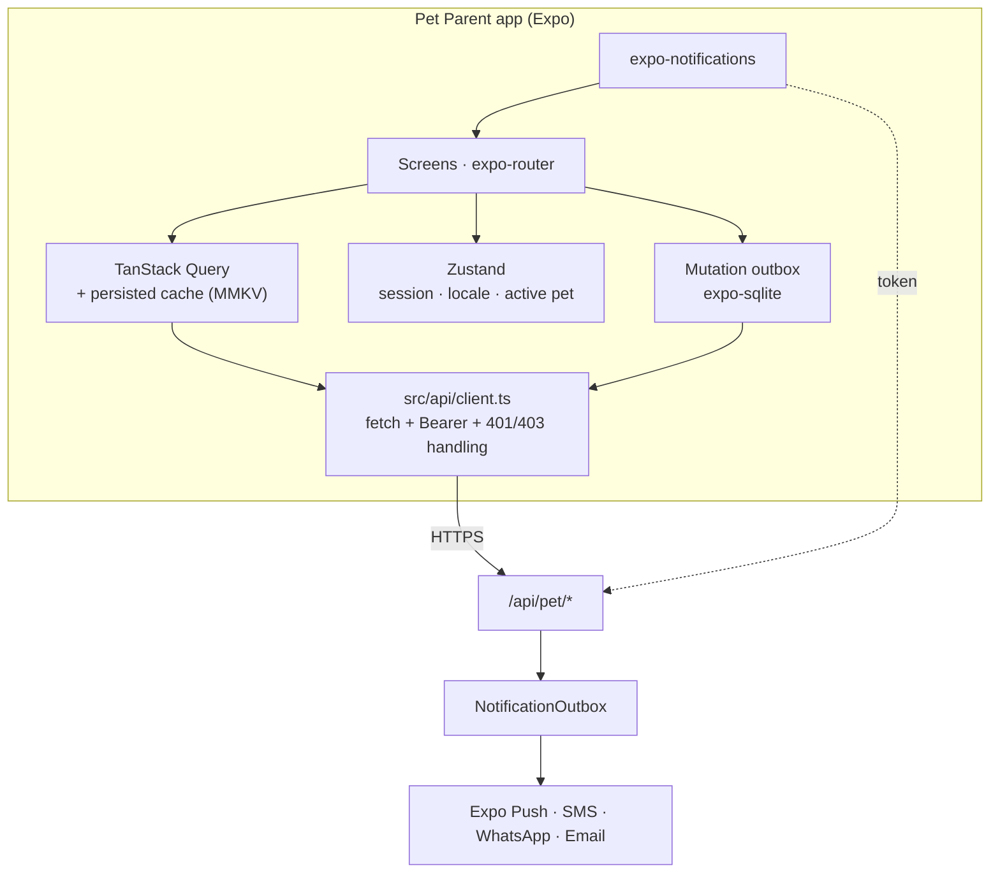

# Elite Vet — Pet Parent App (تطبيق أصحاب الحيوانات) — Build Plan

> **Audience:** the agent(s) building the owner-facing mobile app **and** the server work it
> needs inside `elite-vet`. This document is the specification; it is self-contained.
>
> **Deliverable:** an Expo / React Native app (iOS + Android + a thin web fallback) that lets a
> pet owner hold their pets' records, book and manage visits, pay, talk to the clinic, and be
> reminded of what is due — across **every Elite Vet clinic they deal with**, from one login.
>
> **Code lives at** `d:\repos\elite-vet-parent` (sibling of `elite-vet` and `elite-vet-van`,
> same shape as the van app). **Server code lives in `elite-vet`** under
> `src/server/pet-portal/`.
>
> **Naming:** the product is "تطبيق أصحاب الحيوانات" / *Pet Parent App*. In code and API paths
> the prefix is `pet-portal` / `/api/pet`. "Patient" in this repo means the **animal**, never
> the human — do not name anything `patient-app`, it reads as a human-medicine portal.

---

## 0. TL;DR — what this actually costs

| | |
|---|---|
| **New client app** | ~46 screens, Expo, Arabic-first RTL. Mirrors `elite-vet-van` structurally. |
| **New server module** | `src/server/pet-portal/` — a **new auth realm**, ~55 endpoints, ~14 new Prisma models. |
| **Four hard blockers** | Owner identity is clinic-scoped; phone normalisation is forked in two places; there is **no owner-visibility model on any clinical record**; there is **no SMS/WhatsApp/push transport and no payment gateway** anywhere in the repo. §5. |
| **Sequencing** | PP0→PP3 is the smallest thing worth shipping (auth + read-only records + booking). Everything after that is additive. |
| **The one thing that will bite** | Not the app. It is §9 — deciding, per record type, what an owner is allowed to see, and building the release gate for it. Every competitor solves this with *vet-controlled sharing*; the repo currently has zero fields for it. |

---

## 1. Scope

### In scope (v1 → v3)

A single app that spans clinics. One pet owner, one login, N clinics, M pets.

### Explicit non-goals

| Not building | Why |
|---|---|
| A social network / pet feed | No revenue path, high moderation cost. |
| A marketplace / e-commerce store | Separate product. Retail sale of food & products can come later via the existing `InventoryItem`/`Sale` models. |
| An owner-editable medical record | The clinical record is the clinic's legal document. Owners *read* it and *contribute* (weight, photos, symptom diaries) into clearly-separated owner-authored tables. Never into `ClinicalExam`, `VitalSignsRecord`, or `VaccinationRecord`. |
| Offline-first authoring | Same call as the van app: **offline-tolerant, not offline-first**. Reads are cached; writes queue and retry; nothing forks. |
| Replacing the existing no-login link surfaces | `/book/$slug`, `/request-visit/$slug`, `/track/$token`, `/call/$room` and the grooming report-card token stay. The app **wraps** them for logged-in owners; a link recipient without the app still works. |

---

## 2. Decisions already made (do not relitigate)

| # | Decision | Rationale |
|---|---|---|
| **D1** | **Expo (managed) + React Native**, expo-router, EAS Build. | Exact match to `elite-vet-van`. Two apps, one toolchain, one CI story, transferable code (theme, i18n, api client, secure store). |
| **D2** | **Pet owners are NOT `User` rows.** A separate table (`PetOwnerAccount`), a separate session table, a separate token namespace, a separate Elysia prefix (`/api/pet`). | The `User` table is wired to `ClinicUser`, `Staff`, `permissions.ts`, chat, tasks and inbox. Any bug that lands an owner in that graph exposes an entire clinic. Physical separation is the only guarantee that costs nothing to maintain. |
| **D3** | **Phone + OTP is the identity.** No password. Email optional, for receipts only. | `Owner` already keys on `@@unique([clinicId, phone])`. Phone is the one field every clinic reliably records. Passwords for a low-frequency consumer app are pure support cost. |
| **D4** | **Clinic linking is automatic on phone match, and reversible.** Signing in as `+966…` links every non-deleted `Owner` row with that phone, in every clinic. A clinic can revoke; an owner can hide a clinic. | This is the whole multi-clinic feature, and it falls out of an existing DB constraint. |
| **D5** | **Arabic-first, RTL** (`I18nManager.forceRTL(true)`), English strings present but Arabic ships as default. Server error messages are Arabic and displayed **verbatim**. | Matches web app + van app + the global error handler in `src/server/app.ts`. |
| **D6** | **Vet-controlled disclosure.** No clinical artefact reaches an owner until a staff action or an explicit rule releases it. Default = not visible. | §9. This is how Digitail, Vello and GreatPetCare all work, and it is a clinical-safety requirement, not a preference. |
| **D7** | **Payments through one SAMA-licensed gateway behind a port interface.** Primary: **Moyasar**. | Saudi-native, SAMA-licensed, published mada pricing, ~96% mada approval, T+1 settlement, Apple Pay + STC Pay. Tap and HyperPay are the documented swaps; keep the integration inside `src/server/pet-portal/payments/gateway.port.ts` so the swap is one file. |
| **D8** | **One outbound notification outbox, many channels.** Push (Expo) → in-app → email → SMS → WhatsApp, in that cost order. | The repo today has *only* nodemailer. `ClinicNotificationSettings` even documents the absence: «لا يوجد ناقل واتساب في النظام». The app cannot ship reminders without building this. Build it once, and the vaccination/nutrition/grooming due-engines get it for free. |
| **D9** | **The portal never invents clinical logic.** Due dates come from the existing vaccination/nutrition/grooming/care-plan engines. Prices come from the existing pricing services. Slots come from the existing scheduling engine. | A second due-date implementation on the client is a guaranteed divergence. The app is a *view*. |
| **D10** | **`/api/pet/*` is grouped into ONE `.use()` in `src/server/index.ts`.** | The chain is at **86 `.use()` calls** and the file header documents a hard TypeScript ceiling (TS2589 surfacing in `app.ts`, far from its cause). Register `petPortalServer` from `src/server/pet-portal/index.ts`, exactly like `mobileClinicsServer`. |
| **D11** | **Account deletion removes the *portal account*, never the *medical record*.** | Store policy requires in-app deletion; clinical retention law requires the record survives. The deletion screen must say this in Arabic, plainly. §15. |
| **D12** | **Two credentials are NOT needed** (unlike the van app). One owner session token is enough; there is no device-pairing kill-switch requirement. Device rows exist only for push tokens and per-device revocation. | The van's `X-Mobile-Unit-Token` exists to let a dashboard disable a *vehicle*. There is no analogous requirement here. |

---

## 3. Market baseline — what a 2026 pet-parent app is expected to do

Synthesised from PetDesk, Digitail, Vello (IDEXX), GreatPetCare (Covetrus), AllyDVM PetPage,
VitusVet and Otto. Full sources in §21.

| Capability | PetDesk | Digitail | Vello | GreatPetCare | **Us (target phase)** |
|---|:--:|:--:|:--:|:--:|---|
| Real-time booking that writes back to the clinic calendar | ✓ | ✓ | ✓ | ✓ | **PP3** |
| Appointment reminders / confirmations (email + SMS + push) | ✓ | ✓ | ✓ | ✓ | **PP4** |
| Vaccine history + downloadable certificate | ✓ | ✓ | ✓ | ✓ | **PP2** |
| Medical records / lab results view | ✓ | ✓ | ✓ | ✓ | **PP6** (release-gated) |
| Visit summary & discharge instructions | – | ✓ | ✓ | ✓ | **PP6** |
| Two-way chat with the clinic | ✓ | ✓ | ✓ | ✓ | **PP7** |
| Video / telemedicine | – | ✓ | ✓ | – | **PP7** (LiveKit already in repo) |
| Prescription refill request | ✓ | – | ✓ | ✓ | **PP8** |
| In-app invoice + payment | – | ✓ | ✓ | ✓ | **PP5** |
| Symptom triage before the visit | – | ✓ | – | – | **PP8** (the repo already has an AI agent module) |
| Care to-do list / medication reminders | ✓ | ✓ | ✓ | ✓ | **PP4** |
| Client education library | – | ✓ | – | ✓ | **PP8** |
| Wellness plan / subscription management | – | – | ✓ | ✓ | **PP9** — the repo already has `Subscription`, `SubscriptionPlan`, `CarePlan` |
| Pet insurance | ✓ | – | – | ✓ | Out of v1 |
| "Ready for pickup" notification | ✓ | – | – | – | **PP4** — trivial, `AppointmentStatus` already models it |

**Two things we can ship that none of them can:** live **mobile-clinic van tracking** (the
`/track/$token` engine already exists, with coarsened GPS) and a **grooming report card**
with photos (`GroomingReportCard` + `GroomingPhoto` already exist and already have a token
surface). Lead with those.

**Business case for PP9 (wellness plans):** the veterinary wellness-plan market was ~USD 3.47B
in 2026; plan members are the most engaged client segment, and recurring revenue is the single
largest multiplier on practice valuation. The models are already in the schema — this is a
pricing/UI problem, not a data problem.

---

## 4. What the backend already has (audited 2026-08-24)

### Already there — reuse, do not rebuild

| Thing | Where | Note |
|---|---|---|
| Public clinic profile, staff, services, animal types, **live slot search** | `src/server/public/public.controller.ts` | Unauthenticated. `GET /public/clinic/:slug/staff/:staffId/slots` is the booking engine. |
| Public booking submission with rate limiting + attachments | `src/server/public-bookings/` | IP-bucketed (20 attempts / 5 successes per hour). |
| Mobile-visit request + **owner live tracking with coarsened GPS** | `src/server/mobile-clinics/mobile-requests/`, `mobile-tracking/` | `MobileVisit.trackingToken`. Stream stops when the visit finishes. Exemplary privacy design — copy its posture. |
| Grooming report card by token | `GET /grooming/report-card/:token` | |
| Video calls (LiveKit) + a no-login `/call/$room` and `/pay/$room` page | `src/server/video-calls/` | `pay.$room.tsx` says in a comment: no gateway integration yet, the button just advances the stage. |
| Vaccination engine: antigens, vaccines, protocols, doses, due computation, records | `src/server/vaccinations/`, `VaccinationRecord`, `VaccinationProtocolDose` | Due dates and "age unknown" handling are already correct — **do not reimplement on the client**. |
| Nutrition plans + energy calc + rechecks | `src/server/nutrition/`, `NutritionPlan` | |
| Grooming sessions, intake, photos, findings, report cards | `src/server/grooming/` | |
| Care plans + enrolments + visits + medications | `src/server/care-plans/`, `CarePlan*` | The backbone of a wellness-plan product. |
| Consents with e-signature | `PatientConsent`, `ConsentTemplate`, `SignatureMethod`, `consent-render.service.ts` | Already renders a signable document. Owner-side signing is a UI, not a new engine. |
| Invoices with tax lines, refunds, statuses | `Invoice`, `InvoiceTax` | Has a vestigial `stripePaymentIntentId` — unused. |
| Uploads to S3 with a local-dev fallback | `src/server/uploads/upload-storage.ts` | Reuse verbatim for owner-uploaded photos. |
| Staff↔staff chat with attachments | `Conversation`, `ConversationMember`, `ChatMessage` | **`ConversationMember.userId → User`** — owners cannot join without a schema change. §7. |
| Transactional email | `src/lib/email/` | nodemailer over Gmail SMTP. Adequate for dev, **not** for production volume. |
| Phone parsing to E.164 | `src/lib/validation/phone.ts` | See blocker B2. |
| Audit tests as a pattern | `server-layering.audit.test.ts`, `domain-error-reachability.audit.test.ts` | Copy this pattern for the portal's scoping guarantee (§18). |

### Not there at all

- **No `Prescription` model.** Grepped the whole 11,499-line schema: zero hits. A refill feature
  needs a prescription record first, or v1 ships "refill *request*" with no dispensing record.
- **No owner-visibility field anywhere.** Zero hits for `sharedWithOwner` / `releasedToOwner` /
  `visibleToOwner`. Every clinical row is staff-only by construction.
- **No visit summary / discharge instructions model.**
- **No SMS, no WhatsApp, no push.** Confirmed by the schema comment on
  `ClinicNotificationSettings.vaccinationDueEnabled`: the vaccination reminder is an *inbox* item
  and the external send is a manual `wa.me` link.
- **No payment gateway.**
- **No notification outbox / retry / idempotency layer.**
- **No owner authentication of any kind.**

---

## 5. The four blockers — resolve these before PP1

### B1 — Owner identity is clinic-scoped; the app needs it to be global

```prisma
model Owner {
  clinicId String
  phone    String
  @@unique([clinicId, phone])   // ← one human at 3 clinics = 3 rows, 3 ids, 3 code values
}
```

The same human at three clinics is three unrelated rows. A portal login is a *person*, not a
row. **Resolution:** a global `PetOwnerAccount` keyed on E.164 phone, joined many-to-many to
`Owner` via `PetOwnerClinicLink` (§7). Nothing about the existing `Owner` model changes — this
is purely additive, which is why it is safe.

Corollary the UI must handle: **the same pet can exist twice** (once per clinic) with different
`Patient.id`s, different weights and different vaccination histories. Do **not** silently merge
them. Show them grouped with a "same pet?" affordance and let the owner confirm the link
(`PetIdentityLink`, §7). Microchip number is the only reliable join key and it is nullable.

### B2 — `normalizePhone` is forked, and phone is the identity key

Two live implementations that disagree on output:

| File | `0501234567` → | Used by |
|---|---|---|
| `src/lib/validation/phone.ts` | `+966501234567` (E.164, libphonenumber) | public bookings |
| `src/features/services/vaccinations/utils/vaccination-reminder.ts` | `966501234567` (no `+`, hand-rolled) | vaccination `wa.me` links |

`Owner.phone` is stored as whatever path created the row — the admin UI does not normalise at
all. If sign-in matches on a raw string, **owners will silently fail to link to their own
clinics**, and the failure looks like "the clinic isn't there" with no error to debug.

**Resolution, before any portal code:**

1. Promote `src/lib/validation/phone.ts` to the single implementation; delete the vaccination
   copy and derive its `wa.me` form from E.164.
2. Add `Owner.phoneE164 String?` + a unique index `@@unique([clinicId, phoneE164])`, backfilled
   by migration. Keep `phone` as the display value — clinics type what they type.
3. An audit test asserting exactly one `normalizePhone` export in `src/`.
4. Report unparseable rows to the clinic rather than guessing a country code.

### B3 — There is no model for "what an owner may see"

Default-visible is not an option: an unreleased abnormal lab value, an internal note, a
suspected-neglect remark, or a draft radiology report reaching an owner is a clinical and legal
incident. Default-hidden with an explicit release action is the only defensible design, and it
is what every competitor does ("veterinarian-controlled sharing").

**Resolution:** §9's disclosure matrix + a `releasedToOwnerAt` / `releasedByStaffId` pair on the
gated tables, plus one shared helper so the rule is written once. No `/api/pet` DAO may query a
gated table without it.

### B4 — No transport, no gateway

Reminders are the reason owners keep a vet app installed. Today the repo can only send email
through a Gmail SMTP transporter. Push, SMS and WhatsApp are all absent, and so is any payment
gateway. These are **PP4** and **PP5**, the two phases with real external dependencies: Apple/
Google credentials, an SMS sender-ID registration with a CITC-licensed provider (Taqnyat,
Unifonic, Msegat), a WhatsApp Business API number, and a SAMA-licensed merchant account.
**Start the commercial paperwork at PP0** — it has a lead time the code does not.

### B5 (adjacent, owner decision needed) — PDPL data residency

Saudi PDPL's default expectation is that personal data of Saudi residents stays on Saudi
infrastructure; transfer out needs an SDAIA adequacy designation or approved safeguards. The
app collects health-adjacent personal data, location (for home visits) and payment identifiers.
The repo runs Postgres on **Neon serverless** — the region and the transfer basis must be
confirmed *before* a consumer app puts thousands of Saudi residents' data behind it. This is not
a code task; it is a decision (§20, Q7).

---

## 6. Identity & authentication

### Model

```
PetOwnerAccount (global, phone-keyed)
   ├─ PetOwnerClinicLink ──→ Owner (clinic-scoped, existing)
   │                            └─ Patient[] (existing)
   ├─ PetOwnerSession  (one per signed-in device)
   └─ PetOwnerDevice   (push token, platform, revocable)
```

### Sign-in flow

1. **Phone entry** — country picker defaulted to KSA, `phoneSchema` from `src/lib/validation/phone.ts`.
2. **`POST /api/pet/auth/otp/request`** — 6 digits, 5-minute TTL, stored **hashed** (sha256),
   max 5 verify attempts, then the challenge dies. Rate limits: 3 per phone per 15 min,
   10 per IP per hour, 50 per phone per day. Re-request within the TTL returns the *same*
   challenge; it does not mint a new code.
3. **`POST /api/pet/auth/otp/verify`** → creates/loads `PetOwnerAccount`, runs the **link sweep**
   (D4), returns an opaque session token.
4. **Session token** — 32 random bytes, `PET_` prefixed so a leaked one is recognisable in a log
   (the van app's `MUT_` convention), stored sha256-hashed server-side, kept in
   **`expo-secure-store`** on device — never `AsyncStorage`. 90-day sliding expiry, rotated on
   refresh, revocable per device from the Account screen and from the clinic dashboard.
5. **First run after verify** — name, preferred language, notification consent, marketing
   consent (a separate checkbox — PDPL), then the clinic-link confirmation screen.

### The link sweep (D4), precisely

```
on verify(phoneE164):
  for each Owner o where o.phoneE164 == phoneE164 and o.active and not o.isDeleted:
     upsert PetOwnerClinicLink(accountId, ownerId, source = PHONE_MATCH, verifiedAt = now)
  runs again on every sign-in and on a 24h job — a clinic added yesterday must appear today
```

Three other link sources exist because phone match is not always enough:

- **`CLINIC_INVITE`** — staff press "invite to app" on the owner record; a one-time deep link.
- **`CODE_CLAIM`** — the owner types the clinic's `Owner.code` (`OW-A3F9`) printed on their invoice.
- **`STAFF_MERGE`** — staff attach an account to an owner row whose phone differs (the
  household's second number). Always logged.

A link can be `revokedAt` by either side. A revoked link hides the clinic and **immediately**
drops its patients from every scoped query.

### The authorisation macro — one definition, imported everywhere

Follow `mobileAuth` (`src/server/mobile-clinics/mobile-auth.macro.ts`), which exists precisely
because `requireClinic` got copy-pasted into ~60 files.

```ts
// src/server/pet-portal/pet-auth.macro.ts
export const petAuth = new Elysia({ name: "pet-portal/pet-auth" }).macro({
  requirePetOwner: {
    async resolve({ request }) {
      // → 401 غير مصرح        session missing / expired / revoked
      // → 403 الحساب موقوف     account suspended
      // resolves { accountId, ownerIds: string[], clinicIds: string[], patientIds: string[] }
    },
  },
});
```

**Hard rule:** every `/api/pet` DAO function takes `ownerIds` (or a pre-resolved `patientIds`)
as its **first** parameter and filters on it. No exceptions, no "the id came from the session
anyway". This is machine-checked in §18.

---

## 7. Data model additions

All additive. camelCase columns, snake_case `@@map`, `cuid()` ids — repo convention (CLAUDE.md
rule 4). Authored with `prisma migrate diff`, never `db:push`.

```prisma
// ── Identity ──────────────────────────────────────────────────────────────
model PetOwnerAccount {
  id             String   @id @default(cuid())
  phoneE164      String   @unique
  name           String?
  email          String?
  locale         String   @default("ar")
  avatarKey      String?
  status         PetOwnerAccountStatus @default(ACTIVE)   // ACTIVE | SUSPENDED | DELETED
  marketingOptIn Boolean  @default(false)                 // PDPL: separate from transactional
  consentVersion String?                                  // which privacy policy was accepted
  consentAt      DateTime?
  deletedAt      DateTime?
  createdAt      DateTime @default(now())
  updatedAt      DateTime @updatedAt

  links    PetOwnerClinicLink[]
  sessions PetOwnerSession[]
  devices  PetOwnerDevice[]
  requests PetOwnerRequest[]

  @@map("pet_owner_account")
}

model PetOwnerClinicLink {
  id               String   @id @default(cuid())
  accountId        String
  ownerId          String                 // → existing clinic-scoped Owner
  clinicId         String                 // denormalised for cheap scoping queries
  source           PetOwnerLinkSource     // PHONE_MATCH | CLINIC_INVITE | CODE_CLAIM | STAFF_MERGE
  verifiedAt       DateTime?
  hiddenByOwner    Boolean  @default(false)  // owner hides a clinic without breaking the link
  revokedAt        DateTime?
  revokedByStaffId String?
  createdAt        DateTime @default(now())

  @@unique([accountId, ownerId])
  @@index([clinicId, accountId])
  @@map("pet_owner_clinic_link")
}

model PetOwnerSession {
  id          String   @id @default(cuid())
  accountId   String
  tokenHash   String   @unique      // sha256; raw token is PET_<base64url(32B)>
  tokenPrefix String                // «PET_a1b2» — display only
  deviceId    String?
  userAgent   String?
  lastSeenAt  DateTime @default(now())
  expiresAt   DateTime
  revokedAt   DateTime?
  createdAt   DateTime @default(now())

  @@index([accountId])
  @@map("pet_owner_session")
}

model PetOwnerDevice {
  id            String   @id @default(cuid())
  accountId     String
  platform      PetDevicePlatform      // IOS | ANDROID | WEB
  expoPushToken String?  @unique
  appVersion    String?
  osVersion     String?
  pushEnabled   Boolean  @default(true)
  lastSeenAt    DateTime @default(now())
  revokedAt     DateTime?

  @@map("pet_owner_device")
}

model PetOwnerOtpChallenge {
  id         String   @id @default(cuid())
  phoneE164  String
  codeHash   String
  attempts   Int      @default(0)
  channel    OtpChannel  // SMS | WHATSAPP
  consumedAt DateTime?
  expiresAt  DateTime
  createdAt  DateTime @default(now())

  @@index([phoneE164, createdAt])
  @@map("pet_owner_otp_challenge")
}

// ── Cross-clinic pet identity (B1 corollary) ─────────────────────────────
model PetIdentityLink {
  id                 String   @id @default(cuid())
  accountId          String
  patientIdA         String
  patientIdB         String
  confirmedByAccount Boolean  @default(false)
  microchipMatch     Boolean  @default(false)
  createdAt          DateTime @default(now())

  @@unique([accountId, patientIdA, patientIdB])
  @@map("pet_identity_link")
}

// ── Owner-authored content — never mixed with clinical tables ────────────
model PetOwnerObservation {
  id                 String   @id @default(cuid())
  accountId          String
  patientId          String
  kind               OwnerObservationKind  // WEIGHT | SYMPTOM | MEDICATION_GIVEN | PHOTO | NOTE | APPETITE | STOOL
  valueNum           Decimal? @db.Decimal(10, 3)
  valueText          String?
  fileKey            String?
  observedAt         DateTime
  sharedWithClinicId String?                // the owner chooses whether the clinic sees it
  createdAt          DateTime @default(now())

  @@index([patientId, observedAt])
  @@map("pet_owner_observation")
}

// ── Owner-initiated requests (refill, records, callback, certificate) ────
model PetOwnerRequest {
  id               String   @id @default(cuid())
  accountId        String
  clinicId         String
  ownerId          String
  patientId        String?
  kind             PetOwnerRequestKind    // REFILL | RECORDS | CERTIFICATE | CALLBACK | QUESTION | CANCEL_APPOINTMENT
  status           PetOwnerRequestStatus  // NEW | IN_REVIEW | APPROVED | DECLINED | FULFILLED | CANCELLED
  body             String?
  payload          Json?
  handledByStaffId String?
  handledAt        DateTime?
  declineReason    String?
  createdAt        DateTime @default(now())

  @@index([clinicId, status, createdAt])
  @@map("pet_owner_request")
}

// ── Disclosure (B3) ──────────────────────────────────────────────────────
model VisitSummary {                 // the owner-facing artefact of a visit
  id                String   @id @default(cuid())
  appointmentId     String   @unique
  clinicId          String
  body              String            // vet-authored, Arabic
  homeCare          String?
  warningSigns      String?
  recheckAt         DateTime?
  releasedToOwnerAt DateTime?
  releasedByStaffId String?
  createdAt         DateTime @default(now())
  updatedAt         DateTime @updatedAt

  @@map("visit_summary")
}

// + additive columns on existing tables:
//   LabTestOrder.releasedToOwnerAt / releasedByStaffId
//   RadiologyReport.releasedToOwnerAt / releasedByStaffId
//   AppointmentDocument.sharedWithOwner  Boolean @default(false)
//   GroomingReportCard.releasedToOwnerAt      (a token surface exists; the flag makes it a rule)
//   Owner.phoneE164 String?  + @@unique([clinicId, phoneE164])   ← B2

// ── Notifications (B4) ───────────────────────────────────────────────────
model NotificationOutbox {
  id                String   @id @default(cuid())
  clinicId          String?
  accountId         String?
  channel           NotificationChannel   // PUSH | EMAIL | SMS | WHATSAPP | IN_APP
  templateKey       String
  payload           Json
  idempotencyKey    String   @unique      // e.g. "vacc-due:<recordId>:<leadDays>"
  scheduledAt       DateTime
  sentAt            DateTime?
  failedAt          DateTime?
  attempts          Int      @default(0)
  lastError         String?
  providerMessageId String?

  @@index([scheduledAt, sentAt])
  @@map("notification_outbox")
}

model PetOwnerNotificationPreference {
  id              String   @id @default(cuid())
  accountId       String
  category        NotificationCategory  // APPOINTMENT | REMINDER_DUE | RESULTS | BILLING | CHAT | MARKETING
  push            Boolean  @default(true)
  email           Boolean  @default(false)
  sms             Boolean  @default(false)
  whatsapp        Boolean  @default(false)
  quietHoursStart Int?                  // minutes from midnight, clinic-local
  quietHoursEnd   Int?

  @@unique([accountId, category])
  @@map("pet_owner_notification_preference")
}

// ── Payments (B4) ────────────────────────────────────────────────────────
model OwnerPaymentIntent {
  id            String   @id @default(cuid())
  accountId     String
  clinicId      String
  invoiceId     String?
  amount        Decimal  @db.Decimal(10, 2)
  currencyCode  String   @default("SAR")
  provider      PaymentProvider       // MOYASAR | TAP | HYPERPAY
  providerRef   String?  @unique
  status        OwnerPaymentStatus    // INITIATED | PENDING | PAID | FAILED | REFUNDED | EXPIRED
  method        String?               // mada | creditcard | applepay | stcpay
  failureReason String?
  paidAt        DateTime?
  rawWebhook    Json?
  createdAt     DateTime @default(now())

  @@index([clinicId, status])
  @@map("owner_payment_intent")
}
```

**Chat participation.** `ConversationMember.userId` is a hard FK to `User`. Two options:

| Option | Cost | Verdict |
|---|---|---|
| Add nullable `petOwnerAccountId` to `ConversationMember` + `ConversationKind.CLIENT` | Touches a live staff feature; every existing chat query must learn to ignore owner members | **Recommended.** One model, one unread story, staff see client threads in the tool they already use. |
| A separate `ClientThread`/`ClientMessage` pair | Zero risk to staff chat; a second inbox for staff to forget to read | Fallback only if the chat module is under active change. |

---

## 8. API surface — `/api/pet/*`

All routes carry `Authorization: Bearer PET_…` except `/auth/*` and the payment webhook. All are
scoped by the macro. Registered as **one** `.use(petPortalServer)` (D10).

```
# auth
POST   /api/pet/auth/otp/request           { phone, channel }
POST   /api/pet/auth/otp/verify            { phone, code }   → { token, account, links[] }
POST   /api/pet/auth/refresh
POST   /api/pet/auth/sign-out              (this device)
POST   /api/pet/auth/sign-out-all
GET    /api/pet/auth/sessions              device list
DELETE /api/pet/auth/sessions/:id

# account
GET    /api/pet/me                         account + links + unread + due badge counts
PATCH  /api/pet/me                         name, email, locale, avatar
GET    /api/pet/me/export                  PDPL data export (async job → signed URL)
POST   /api/pet/me/delete                  D11 — schedules deletion, 7-day grace, emails a receipt
GET    /api/pet/me/consents                policy versions accepted
POST   /api/pet/me/consents                accept a new policy version

# clinics
GET    /api/pet/clinics                    linked clinics (+hidden, +branches, +contact)
POST   /api/pet/clinics/claim              { code } → CODE_CLAIM link
PATCH  /api/pet/clinics/:linkId            { hidden }
GET    /api/pet/clinics/:clinicId/services bookable services for THIS owner
GET    /api/pet/clinics/discover           nearby/searchable clinics (public data only)

# pets
GET    /api/pet/pets                       grouped across clinics, with duplicate suggestions
GET    /api/pet/pets/:patientId            profile + type/strain + microchip + weights
PATCH  /api/pet/pets/:patientId            owner-editable subset ONLY (photo, coat, microchip*)
GET    /api/pet/pets/:patientId/timeline   merged, release-gated feed
GET    /api/pet/pets/:patientId/vaccinations  records + due + certificate URL
GET    /api/pet/pets/:patientId/weights
POST   /api/pet/pets/:patientId/observations  owner-authored (weight/symptom/photo/med-given)
GET    /api/pet/pets/:patientId/nutrition
GET    /api/pet/pets/:patientId/grooming
GET    /api/pet/pets/:patientId/care-plans
GET    /api/pet/pets/:patientId/documents  released documents only
POST   /api/pet/pets/link                  confirm two clinic records are the same animal

# appointments & booking
GET    /api/pet/appointments               upcoming + past, all clinics, paginated
GET    /api/pet/appointments/:id           + visit summary, invoice, tracking, call link
GET    /api/pet/booking/slots              wraps the existing public slot engine, authenticated
POST   /api/pet/booking                    writes a real Appointment for a known Owner
POST   /api/pet/appointments/:id/cancel    policy-checked; may open a CANCEL request instead
POST   /api/pet/appointments/:id/reschedule
POST   /api/pet/appointments/:id/check-in  geo/QR check-in at the clinic
GET    /api/pet/appointments/:id/tracking  mobile-visit live stage + coarse GPS (SSE)
POST   /api/pet/mobile-visits/request      wraps the existing MobileBookingRequest flow
GET    /api/pet/appointments/:id/call-token LiveKit token — owner identity, publish-only

# records & disclosure
GET    /api/pet/results                    released lab + radiology, all pets
GET    /api/pet/results/:id
GET    /api/pet/visit-summaries/:appointmentId
GET    /api/pet/certificates/vaccination/:patientId  → PDF (offline-cacheable)

# consents
GET    /api/pet/consents                   pending + signed
POST   /api/pet/consents/:id/sign          reuses SignatureMethod + consent-render.service

# billing
GET    /api/pet/invoices                   across clinics, status-filtered
GET    /api/pet/invoices/:id
POST   /api/pet/invoices/:id/pay           → OwnerPaymentIntent + gateway checkout payload
GET    /api/pet/payments/:id               poll status
POST   /api/pet/webhooks/moyasar           (unauthenticated, signature-verified)
GET    /api/pet/receipts/:paymentId        PDF

# messaging
GET    /api/pet/threads
GET    /api/pet/threads/:id/messages
POST   /api/pet/threads/:id/messages       text + attachment (10MB, same cap as staff chat)
POST   /api/pet/threads                    start a thread with a linked clinic

# requests
POST   /api/pet/requests                   REFILL | RECORDS | CERTIFICATE | CALLBACK | QUESTION
GET    /api/pet/requests
GET    /api/pet/requests/:id

# notifications
GET    /api/pet/notifications              in-app centre, paginated
POST   /api/pet/notifications/read
GET    /api/pet/notifications/preferences
PATCH  /api/pet/notifications/preferences
POST   /api/pet/devices                    register Expo push token
DELETE /api/pet/devices/:id

# content
GET    /api/pet/education                  articles, clinic-scoped or global
GET    /api/pet/home                       ONE call that renders the home screen
```

**`GET /api/pet/home` is deliberate.** The home screen needs next-appointment, due items across
four engines, unpaid invoices, unread messages and clinic cards. Six round-trips on a phone on
3G is a two-second blank screen. One endpoint, one cache key, one revalidation.

### Staff-side additions in the web app

The portal is only half the product; the clinic must be able to see and control it.

- Owner record → **«تطبيق المالك»** panel: linked/not, invite button, revoke, last seen, devices.
- **Release actions** on lab orders, radiology reports and documents, plus a visit-summary
  composer on the appointment screen.
- **Client threads** in the existing chat UI (or a new inbox tab).
- **Requests queue** — `PetOwnerRequest` list with approve/decline, wired into the existing
  `InboxItem` machinery so nothing new has to be watched.
- **Settings → portal**: which record types this clinic auto-releases, booking-through-app on/off,
  cancellation window, deposit requirement, notification channel budget.

---

## 9. Disclosure matrix — what an owner may see

**Default for everything not in this table: not visible.**

| Record | Owner sees | Gate |
|---|---|---|
| Own profile, address, phone | ✓ edit | — |
| Pet identity, breed, DOB, microchip, photo | ✓ edit a subset | Microchip edits create a staff verification request; they do not write directly |
| Appointments (own pets) | ✓ | Always |
| `AppointmentInternalNote` | ✗ | **Never.** The name is the contract. |
| Vaccination records + due dates + certificate | ✓ | Always — the single most-requested item in every product studied |
| Weight & owner-visible vitals | ✓ | Always |
| Full `VitalSignsRecord` / `ClinicalExam` / SOAP | ✗ | Replaced by `VisitSummary` |
| `VisitSummary` (discharge instructions) | ✓ | `releasedToOwnerAt` |
| Lab results | ✓ | `releasedToOwnerAt` — and only **whole orders**, never one value out of context |
| Radiology report | ✓ | `releasedToOwnerAt`. Images: report first, images by request |
| Radiology raw DICOM | ✗ | The viewer is a clinical tool |
| Operation case, anaesthesia record, counts | ✗ | Surgical summary via `VisitSummary` only |
| Consents (own pets) | ✓ sign | Always for `PENDING` |
| Invoices, taxes, receipts | ✓ | Always |
| Accounting ledger, cost centres, margins | ✗ | **Never** |
| Grooming report card + photos | ✓ | `releasedToOwnerAt` |
| `GroomingIncident` / `GroomingFinding` | Curated | Findings yes (they are advice); incidents only once staff release them |
| Mobile-visit stage + **coarse** GPS | ✓ | Existing rule: 3-decimal coarsening, stream dies on completion |
| Staff names | Treating vet only | No rota, no crew lists, no internal ids |
| Other owners, other pets, clinic stats | ✗ | **Never** |

Two rules that make this survivable:

1. **One helper, one place.** `isReleasedToOwner(record)` and `scopeToOwner(query, ownerIds)`
   live in `src/server/pet-portal/disclosure.ts`. A second copy is how this rots.
2. **Release is an event, not a flag flip.** Log who released what, when, to which account. The
   day an owner says "I was never told", the log is the answer.

---

## 10. App architecture



Folder layout — **mirror `elite-vet-van` exactly** so an agent can move between them:

```
elite-vet-parent/
  app/                       expo-router
    (tabs)/     index.tsx  pets.tsx  appointments.tsx  messages.tsx  account.tsx
    onboarding/ phone.tsx  otp.tsx  profile.tsx  link-clinics.tsx
    pet/[id]/   index.tsx  vaccinations.tsx  records.tsx  nutrition.tsx  grooming.tsx
    appointment/[id].tsx    book/…   invoice/[id].tsx   pay/[id].tsx
    call/[room].tsx  track/[id].tsx  consent/[id].tsx  notifications.tsx
  src/
    api/        client.ts  contract.ts  mock/    ← contract.ts is the ONLY duplication allowed
    components/ ui/  pet/  health/
    features/   auth  pets  appointments  booking  billing  messages  notifications  records
    i18n/locales/{ar,en}.json
    lib/        storage.ts  secure.ts  outbox.ts  date.ts  format.ts
    providers/  stores/  theme/
```

**Three independent subsystems, same discipline as the van app:**

1. **Query layer** — all reads, persisted to disk so a cold start on a dead network still shows
   last week's vaccination card.
2. **Mutation outbox** — every write goes through SQLite first. A tap in a lift is not lost.
3. **Push handler** — deep-links into the app; never assumes the app was running.

**Type reuse (AGENTS.md is law).** The app cannot import from `elite-vet`, so
`src/api/contract.ts` transcribes the response shapes by hand — the same single-file exception
the van app documents. Nothing else duplicates a server shape. When the server publishes an
OpenAPI document (`@elysiajs/openapi` is already a dependency and is never mounted — mounting it
for `/api/pet` is a half-day and deletes this exception), generate it instead.

---

## 11. Screen inventory

### Onboarding (5)
Language · Phone · OTP (auto-read on Android via SMS Retriever) · Profile · Link clinics found

### Home (1)
Pet switcher · next-appointment card with countdown · **«مستحق الآن»** stack (vaccination due,
nutrition recheck, grooming due, care-plan visit) · unpaid invoices · unread messages · quick
actions (احجز · اسأل الطبيب · اطلب زيارة منزلية) · clinic cards

### Pets (7)
List (grouped by pet, showing which clinics hold a record) · Profile · Timeline · Vaccinations
(+ certificate + share sheet) · Records (released only) · Weight chart · Documents

### Appointments & booking (9)
Upcoming · Past · Detail · Book: clinic → branch → service → vet → slot · Reason & symptoms ·
Confirm (+ deposit) · Reschedule · Cancel (policy-aware) · **Live tracking** (mobile clinic) ·
Video waiting room + call

### Health (5)
Nutrition plan (portions, food, feeding times) · Grooming report card (photo gallery) ·
Care plan (visit schedule + medications) · Medication reminders · Symptom/observation log

### Money (5)
Invoices · Invoice detail · Pay (mada / Apple Pay / STC Pay) · Receipts · Payment methods

### Communication (4)
Threads · Thread · Notification centre · Notification preferences (category × channel + quiet hours)

### Requests (3)
New request (refill / records / certificate / callback) · List · Detail with status timeline

### Account (7)
Profile · Linked clinics (hide / leave / claim by code) · Devices & sessions · Language ·
Privacy policy + consents · **Export my data** · **Delete account** (D11 copy)

### Extras (v2+)
Education library · Wellness plan browse & enrol · Loyalty/points · Referral · Emergency &
first-aid · Lost-pet mode (broadcast + poster) · Insurance

**~46 screens.** Everything after "Extras" is deferrable without breaking the product.

---

## 12. Notifications

### Channel policy (cost order, D8)

`PUSH → IN_APP → EMAIL → SMS → WHATSAPP`. Try push; if the device has no token or push has been
disabled for >72h **and** the message is time-critical (appointment tomorrow, result released,
payment due), escalate one channel. Never escalate marketing.

### The outbox is the whole design

Nothing sends inline from a request handler. Producers write a `NotificationOutbox` row with an
**idempotency key**; a worker drains it. That gives retries, dedup across a restart, an audit
trail, per-clinic rate budgets and quiet-hours deferral for free. The vaccination-due, nutrition-
recheck and grooming-due jobs all become producers — and the clinic finally gets the automated
reminders it does not have today.

### Catalogue (template keys)

`appointment.booked` · `appointment.reminder.24h` · `appointment.reminder.2h` ·
`appointment.rescheduled` · `appointment.cancelled` · `appointment.ready_for_pickup` ·
`visit.summary_released` · `result.released` · `vaccination.due` · `nutrition.recheck_due` ·
`grooming.due` · `careplan.visit_due` · `invoice.issued` · `invoice.overdue` ·
`payment.received` · `consent.pending` · `chat.message` · `request.status_changed` ·
`mobile_visit.en_route` · `mobile_visit.arrived`

Every template is authored **Arabic-first** with an English sibling, and every one lives in a
single registry file with its channel eligibility and category — so the preference screen is
generated from the registry, not hand-maintained.

### Push mechanics

Expo push service (one token abstraction over APNs + FCM v1). Android 13+ requires a runtime
`POST_NOTIFICATIONS` prompt — ask it **in context**, after the first booking, not on launch. iOS:
request provisional authorisation first, upgrade after the owner engages. Handle receipts and
prune `DeviceNotRegistered` tokens — an unpruned token list is how a push bill grows.

### SMS / WhatsApp

A CITC-licensed Saudi provider (Taqnyat, Unifonic, Msegat) with a registered sender ID; OTP
templates need pre-registration. WhatsApp is the better UX in KSA and the better economics for
utility templates — but it needs a Business API number and template approval, so it lands after
SMS, not before it.

---

## 13. Payments

- **Gateway port**: `charge(intent) → checkoutPayload`, `verify(webhook) → status`,
  `refund(ref, amount)`. Moyasar first (D7); Tap/HyperPay are documented swaps.
- **Flow**: `POST /api/pet/invoices/:id/pay` → `OwnerPaymentIntent(INITIATED)` → gateway checkout
  (hosted page in an in-app browser for v1; native mada/Apple Pay sheet in v2) → webhook →
  `PAID` → `Invoice.amountPaid` / `status` updated **inside one DB transaction**.
- **Never trust the client's "I paid" callback.** The webhook is the source of truth; the app
  polls `GET /api/pet/payments/:id`.
- **Idempotency**: the webhook may arrive twice, and before the redirect. `providerRef` is unique
  and the handler is a no-op on a second delivery.
- **Deposits** for booking: an optional per-clinic setting, the same intent machinery, refundable
  on cancellation inside the window.
- **Accounting**: the accounting module is **paused** (CLAUDE.md). v1 records the payment on the
  existing `Invoice` and leaves ledger posting to the existing clinic-invoice adapter path.
  **Do not** write to `gl_entry` or `payment_ledger_entry` from the portal. See Q5.
- Delete the vestigial `Invoice.stripePaymentIntentId` or repurpose it — do not leave two payment
  reference columns.

---

## 14. Telemedicine, consents, refills

**Telemedicine.** LiveKit is already integrated and `AppointmentLocation.REMOTE` already exists.
The app needs a waiting room, a pre-call device check, an owner-scoped token (`canPublish`,
**not** `roomAdmin` — the clinic hosts), and a graceful "the vet will join shortly".
*Regulatory:* remote consultation is only defensible inside an existing vet-client-patient
relationship; the AVMA position and every US state that has legislated on it say the same, and
controlled substances require an in-person exam essentially everywhere. Build the guard rail: an
appointment can only be `REMOTE` if the pet has a prior in-clinic visit at that clinic, unless a
staff member overrides with a recorded reason. Saudi-specific rules must be confirmed (Q6).

**Consents.** `PatientConsent` + `ConsentTemplate` + `consent-render.service.ts` already render a
signable document with a `SignatureMethod`. Owner-side signing is a screen: render → scroll-to-end
gate → draw signature → submit with timestamp, IP and the rendered document hash. Pre-visit
consent signing is a real front-desk time saver and one of the easiest wins in the whole plan.

**Refills.** There is **no `Prescription` model** (§4). Two options:

- *v1 (PP8)*: `PetOwnerRequest(kind = REFILL)` — free text + the pet + a prior medication picked
  from `CarePlanMedication` / `PostOpOrder` history. Staff fulfil manually. Ships in days.
- *v2*: a real `Prescription` module (drug, dose, route, duration, refills remaining, prescriber,
  dispense log) built on the existing `DrugCatalogProduct` / `DrugMonograph` / `DrugMonographDose`
  tables. That is a module in its own right, not a portal feature — scope it separately.

---

## 15. Compliance

### PDPL (Saudi)

- Explicit, freely-given **opt-in**, presented in Arabic, before any collection. Transactional and
  marketing consent are **separate** — the enforcement decisions issued so far specifically cite
  marketing without consent.
- Lawful basis recorded per account (`consentVersion`, `consentAt`); re-consent on policy change.
- **Data residency**: the default expectation is Saudi infrastructure; transfer out needs adequacy
  or approved safeguards → Q7, a hosting decision, not a code one.
- Data-subject rights: access (**export**), rectification (profile edit + a request path for
  clinical data), erasure (D11). Ship both as product features, not a support inbox.
- **72-hour breach notification** to SDAIA — needs a named owner and a runbook, not code.
- A DPIA before launch: health-adjacent data + location + payment identifiers is exactly the
  profile that draws scrutiny.

### App stores

- **In-app account deletion is mandatory** (Apple; Google also accepts a web link but wants the
  in-app path). It must state what is deleted and what is retained and why — which is exactly
  D11's awkward truth: *portal account deleted, clinical record retained by the clinic under its
  legal retention duty*. Write that sentence in Arabic and put it on the screen.
- **Privacy nutrition labels / Data safety form** must declare Contact Info, Health & Fitness,
  Financial Info, Location, User Content, Identifiers, Purchases, Diagnostics — and the same for
  every bundled SDK (Sentry, the gateway SDK, Expo).
- **Health & Fitness / Medical category**: from spring 2026 Apple lets (and in some regions
  expects) a regulatory-status declaration. Position the app as a **client-service app for a
  licensed veterinary clinic**, not a diagnostic tool, and keep every string consistent with that.
- Location permission strings must explain *why* (home-visit address, van tracking) in Arabic.
- Age rating, support URL, privacy-policy URL, and a demo account for review — a reviewer cannot
  get past a phone OTP without one. Ship a reviewer bypass number gated by a build flag.

---

## 16. Design & RTL

- Arabic-first. `I18nManager.forceRTL(true)` at boot, before the first render, with a one-time
  reload guard (the van app has this — copy it).
- **AGENTS.md RTL rules apply to React Native too**: logical properties only
  (`paddingStart` / `marginEnd` / `start` / `end`), never `left` / `right`; DOM order decides
  sides; direction-implying icons flip.
- Fonts: **Tajawal** (Arabic) + **Archivo** (Latin) — already the van app's choice and the web
  app's family. Numerals: Western digits (Arabic-Indic is a per-clinic setting at most).
- Radius **4px flat** everywhere — the web app pinned this; the two apps must not diverge.
- A consumer app is not the admin app. Bigger touch targets, more whitespace, photography, one
  primary action per screen. Do **not** port the dense admin table aesthetic.
- Dark mode from day one — it is a consumer app and it will be opened at 2am.
- Accessibility: dynamic type, ≥4.5:1 contrast, Arabic screen-reader labels. A vaccination
  certificate a 60-year-old cannot read is a failed feature.

---

## 17. Phase plan

One phase = one PR = one CI run. Each phase lists its exit criteria. Repo rules 8 / 11 / 12
apply: **a phase is not done until a concluded green CI run covers its head**, and a walkthrough
is only evidence once it has been executed as written, through the product's own HTTP/UI surface.

| Phase | Server (elite-vet) | App (elite-vet-parent) | Exit criteria |
|---|---|---|---|
| **PP0 — Foundations** | Resolve **B2** (one `normalizePhone`, `Owner.phoneE164` + backfill migration + audit test). Optionally mount `@elysiajs/openapi` for `/api/pet`. | Repo scaffold, expo-router, RTL boot, i18n ar/en, theme tokens, fonts, Sentry, EAS profiles, `src/api/client.ts` + mock server. | App boots RTL on a device; mock home renders; backfill migration green in CI; phone audit test passes. **In parallel start:** Apple/Google accounts, SMS sender-ID registration, Moyasar merchant application, WhatsApp BSP. |
| **PP1 — Identity** | `PetOwnerAccount/Session/Device/OtpChallenge/ClinicLink`, `petAuth` macro, `/auth/*`, `/me`, `/clinics`, link sweep, scoping audit test. Staff-side "invite to app" + link panel. | Onboarding (5 screens), secure-store session, 401/403 handling, sign-out, device registration. | An owner with rows at two clinics signs in once and sees both. Revoking a link from the dashboard hides that clinic within one refresh. Scoping audit test green. |
| **PP2 — Read-only core** | `/pets`, `/pets/:id`, `/timeline`, `/vaccinations`, `/weights`, `/appointments`, `/home`, vaccination certificate PDF. | Home, pet list/profile/timeline, vaccination screen + certificate + share, appointments list/detail, persisted query cache. | Airplane-mode cold start still shows the last-fetched certificate. `/home` is one call. |
| **PP3 — Booking** | `/booking/slots` (wrapping the existing engine), `/booking`, cancel/reschedule with a per-clinic policy, check-in. | Booking flow, reschedule, cancel, check-in. | A booking made in the app lands on the clinic calendar with the right `Owner`/`Patient` and **no duplicate owner row**. Double-booking is impossible (the existing `SlotUnavailableError` path is exercised). |
| **PP4 — Notifications** | `NotificationOutbox` + worker + template registry + preferences; Expo push sender; email adapter; **SMS adapter**; the four due-engines become producers. | Push registration & permission-in-context, notification centre, preference screen with quiet hours, deep links. | A booking sends one push and exactly one — proven by the idempotency key under a duplicated worker run. Quiet hours defer, they do not drop. |
| **PP5 — Billing & payments** | Gateway port + Moyasar adapter, `OwnerPaymentIntent`, webhook with signature verification + replay safety, receipts. | Invoices, detail, pay sheet, receipts, payment history. | A mada test payment moves an `Invoice` to `PAID` in one transaction; the webhook delivered twice changes nothing the second time; a failed payment leaves no half-state. |
| **PP6 — Records & disclosure** | `releasedToOwnerAt` columns, `disclosure.ts`, `VisitSummary` + a staff composer, `/results`, `/visit-summaries`, `/documents`, consent signing. | Records screen, result detail, visit summary, document viewer, consent signing. | An unreleased result is invisible to the owner **and absent from every payload** — verified by an API-level test, not a UI check. Release logs an event. |
| **PP7 — Talk** | Owner participation in `Conversation`, `/threads/*`, owner LiveKit token, REMOTE-visit guard rail. | Threads, chat with attachments, video waiting room + call. | An owner and a staff member exchange messages, unread counts are correct on both sides, and a video visit connects on a real device on cellular. |
| **PP8 — Requests & triage** | `PetOwnerRequest` + a staff queue wired to `InboxItem`, education content endpoints, AI symptom triage on the existing agent module. | Request flows, education library, triage. | A refill request reaches the clinic inbox, is approved, and the owner sees the status change without calling the front desk. |
| **PP9 — Wellness & loyalty** | Wellness plans on `CarePlan` + `Subscription`, in-app enrolment, recurring billing. | Plan browse, enrol, manage, benefits used. | An enrolment creates a subscription and the plan's visits appear on the pet's schedule. |
| **PP10 — Mobile clinics** | Nothing new — wrap `mobile-requests` + `mobile-tracking` behind `/api/pet`. | Home-visit request, live tracking map, arrival push. | In-app tracking matches `/track/$token` exactly, including the coarsening and the stream ending on completion. |
| **PP11 — Compliance & launch** | `/me/export` job, `/me/delete` with grace period + retention disclosure, reviewer bypass, rate-limit hardening, pen-test fixes. | Deletion & export screens, privacy screens, store metadata, screenshots, onboarding polish. | Both stores accept. Deletion removes portal data and demonstrably retains the clinical record. A third-party review of `/api/pet` has no open high findings. |

**Smallest shippable product: PP0–PP3.** It is already better than what most Saudi clinics offer.
PP4 and PP5 are what make it *retained* and *paid for*.

---

## 18. Testing & CI

- **The scoping audit test is the most important test in the module.** Mirror
  `src/server/server-layering.audit.test.ts`: statically assert that every exported function in
  `src/server/pet-portal/**/*.dao.ts` takes an owner/patient scope as its first parameter, and
  that no Prisma call inside one targets a gated table without the disclosure helper. It runs in
  the **fast** suite (no DB) and it is the guarantee that survives future contributors.
- **Controller-level tests, not just service-level** (CLAUDE.md rule 12): every `/api/pet`
  endpoint gets an authorized-passes and an unauthorized-403 test, plus a **cross-tenant** test —
  account A must never read account B's pet, asserted on the HTTP response, not the DAO.
- Disclosure tests: for each gated table, one test that an unreleased row is absent from the payload.
- OTP tests: rate limits, expiry, attempt lock-out, replay of a consumed challenge.
- Payment tests: duplicate webhook, out-of-order webhook, webhook before redirect, refund.
- Notification tests: idempotency-key collisions, quiet-hours deferral, escalation rules.
- App: Maestro (or Detox) for the five critical flows — sign-in, book, pay, view certificate,
  delete account — on Android; unit tests for the outbox and the date/RTL formatters.
- CI: the pet-portal suites join the existing two-tier setup — fast tier on every push, the
  `full-ci` label at every phase exit. DB-backed portal tests only truly run in the full tier.

---

## 19. Risks

| Risk | Impact | Mitigation |
|---|---|---|
| **Phone data quality** (B2) | Owners cannot link to their clinics; looks like the app is broken | Backfill + a report of unparseable rows handed to each clinic to fix **before** their owners are invited |
| **A record leaks to the wrong owner** | Existential | Default-hidden, one scoping helper, machine-checked audit test, cross-tenant HTTP tests, third-party review at PP11 |
| **Clinics do not release records**, so the app looks empty | Product failure by inertia | Per-clinic auto-release settings with sensible defaults (vaccinations + invoices + visit summaries auto; lab/radiology manual), plus a release nudge in the staff workflow |
| Notification cost / spam | Uninstalls and a bill | Cost-ordered channels, per-category preferences, quiet hours, per-clinic budgets, separate marketing opt-in |
| PDPL residency (B5) | Launch blocker discovered late | Decide at PP0, not PP11 |
| Store rejection over the OTP wall | Weeks of delay | Reviewer bypass number from PP1; deletion + labels done at PP11 with slack |
| Two apps drift (van vs parent) | Double maintenance | Shared conventions now; extract a shared package only if a third app appears |
| Accounting module is paused | Portal payments could post into a half-built ledger | Portal writes to `Invoice` only; ledger posting stays with the existing adapter (Q5) |
| Elysia type-depth ceiling | A `.use()` in the wrong place breaks typecheck in an unrelated file | One `petPortalServer` group (D10) — non-negotiable |

---

## 20. Open questions — owner decisions needed before PP1

| # | Question | Why it blocks |
|---|---|---|
| **Q1** | Is this **one app across all Elite Vet clinics** (D4), or a per-clinic white-label build? | Changes identity, branding, store listings and the whole link model. The plan assumes one app. |
| **Q2** | Which clinical records auto-release, and which require a vet action? | §9's defaults are a proposal, not a decision. Needs a vet's sign-off. |
| **Q3** | Can an owner **book directly** into the calendar, or does the app create a *request* staff confirm? | PP3's entire shape. Direct booking is the competitive feature; request-only is safer for fragile schedules. Recommendation: a per-clinic setting defaulting to request-only, flipped to direct once a clinic trusts it. |
| **Q4** | Which payment gateway, and who holds the merchant account — Elite Vet or each clinic? | Per-clinic merchant accounts mean split settlement and a much larger onboarding flow. |
| **Q5** | Portal payments while accounting is paused: record on `Invoice` only (recommended) or wait for the ledger adapter? | PP5 scope. |
| **Q6** | Saudi regulatory position on veterinary telemedicine and remote prescribing? | PP7's guard rails. |
| **Q7** | PDPL data residency: where does the Neon database physically live, and what is the transfer basis? | Legal exposure for the whole product, not just the app. |
| **Q8** | A real `Prescription` module (v2) or refill-as-a-request (v1)? | §14. |
| **Q9** | Co-owners / family sharing in v1? (Two accounts on one pet — spouse, adult child, a boarding facility.) | A common request that touches the link model, so decide before PP1 rather than retrofitting. |
| **Q10** | Web fallback: is a responsive web build of the portal in scope, or app-only? | Expo web is nearly free here and it removes the "I don't want another app" objection. |

---

## 21. Sources

Market and product research (accessed 2026-08-24):

- [Digitail — Pet Parent App](https://digitail.com/pet-parent-app/)
- [PetDesk — Veterinary Mobile App](https://petdesk.com/products/veterinary-mobile-app)
- [Covetrus — GreatPetCare Pet Parent Portal](https://covetrus.com/covetrus-platform/client-engagement-tools/pet-parent-portal/)
- [IDEXX — Vello Client Engagement Platform](https://software.idexx.com/vello)
- [AllyDVM — PetPage Patient Portal](https://www.allydvm.com/solutions/petpage-patient-portal)
- [VitusVet — Digital Veterinary Medical Records](https://vitusvet.com/features/veterinary-electronic-health-records-software/)
- [Owner Exchange — Best Veterinary Online Scheduling & Booking Software 2026](https://ownerexchange.com/veterinary-online-scheduling-software/)
- [Owner Exchange — Best Veterinary Client Communication Software 2026](https://ownerexchange.com/veterinary-client-communication-software/)
- [Vet Software Hub — Veterinary Wellness Plan Software 2026 Buyer's Guide](https://www.vetsoftwarehub.com/article/veterinary-wellness-plan-software-2026-a-buyers-guide)
- [Market Intelo — Veterinary Wellness Plans Market](https://marketintelo.com/report/veterinary-wellness-plans-market)

Regulatory and platform:

- [Securiti — Saudi Arabia Personal Data Protection Law (PDPL)](https://securiti.ai/saudi-arabia-personal-data-protection-law/)
- [SGC — SDAIA and Saudi PDPL: What Saudi Organizations Must Know in 2026](https://www.sgc.consulting/sdaia-saudi-personal-data-protection-law-pdpl-compliance-guide/)
- [Magist — PDPL requirements for apps in Saudi Arabia, 2026](https://clearlaunch.dev/regulations/saudi-pdpl)
- [Google Play — App account deletion requirements](https://support.google.com/googleplay/android-developer/answer/13327111)
- [Google Play — Data safety section](https://support.google.com/googleplay/android-developer/answer/10787469)
- [Apple Developer — Health and fitness apps](https://developer.apple.com/health-fitness/)
- [VetWise — Veterinary Telemedicine Regulations 2026: State-by-State VCPR Guide](https://www.getvetwise.com/posts/veterinary-telemedicine-regulations-2026)

Technical:

- [Expo — Push notifications setup](https://docs.expo.dev/push-notifications/push-notifications-setup/)
- [Expo — Using push notification services (FCM/APNs)](https://docs.expo.dev/guides/using-push-notifications-services/)
- [Logio Legion — Tap Payments vs HyperPay vs Moyasar, Saudi Arabia 2026](https://logiolegion.com/blogs/tap-payments-vs-hyperpay-vs-moyasar-saudi-arabia-2026)
- [Logio Legion — Payment Gateway Integration Saudi Arabia (2026): mada, HyperPay, Moyasar](https://logiolegion.com/blogs/payment-gateway-integration-saudi-arabia-developer-guide)
- [Taqnyat — SMS service (CITC-licensed Saudi provider)](https://taqnyat.sa/en/channels/sms/)
- [Msegat — SMS](https://www.msegat.com/en/sms/)

Internal (this repo, audited 2026-08-24): `AGENTS.md`, `CLAUDE.md`,
`docs/mobile-clinics-driver-app-plan.md`, `docs/DESIGN_SYSTEM_CONTRACT.md`,
`prisma/schema.prisma` (11,499 lines), `src/server/index.ts` (86 `.use()` calls),
`src/server/mobile-clinics/mobile-auth.macro.ts`, `src/server/mobile-clinics/mobile-tracking/`,
`src/server/public/`, `src/server/public-bookings/`, `src/lib/validation/phone.ts`,
`src/features/services/vaccinations/utils/vaccination-reminder.ts`.
